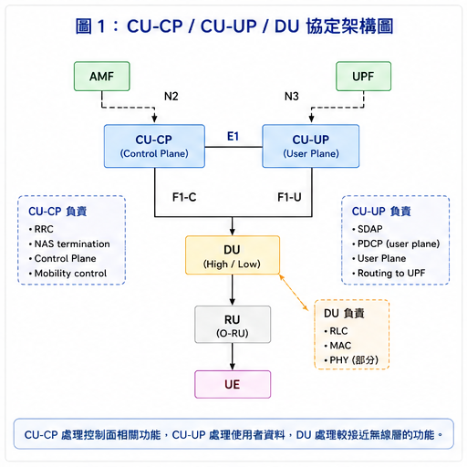

# 02. OCUDU Architecture and Interfaces
## 本章目標

本章的目標是進一步理解 OCUDU 的內部架構，釐清 **CU-CP、CU-UP、DU-high、DU-low 與 RU** 各自負責的功能，並建立 **E1、F1、FAPI 與 Open Fronthaul** 等介面在整個 5G RAN 中的位置與關係。

## 學習紀錄
- **學習日期：** 2026/08/23
- **投入時間：** 約 2.5 小時
- **主要閱讀內容：** OCUDU Architecture Overview、CU/DU Components、gNB Interfaces、O-RAN Architecture
- **本次重點：** 理解 CU-CP、CU-UP、DU-high、DU-low 與 RU 的功能分工，並整理 E1、F1、FAPI、Open Fronthaul 等重要介面的位置與用途。
## 2.1 Architecture Overview

在 5G RAN 中，一個 gNB 可以拆成 CU、DU 與 RU；OCUDU 則進一步把 CU 與 DU 分成更細的功能模組：

```text
gNB
│
├── CU
│   ├── CU-CP
│   └── CU-UP
│
├── DU
│   ├── DU-high
│   └── DU-low
│
└── RU
```

如果把 5G Core 一起放進來，可以整理成：

```text
                    5G Core
                 AMF       UPF
                  │         │
                 N2        N3
                  │         │
              CU-CP ← E1 → CU-UP
                  │         │
                F1-C      F1-U
                  │         │
                  └────┬────┘
                       │
                    DU-high
                   RLC + MAC
                       │
                      FAPI
                       │
                    DU-low
                   Upper PHY
                       │
                Open Fronthaul
                       │
                      RU
                Lower PHY + RF
                       │
                      UE
```

這套架構的重點，不只是把 gNB 拆成很多程式，而是把不同 RAN 功能分開，再利用標準化介面把它們連接起來。

### CU-CP / CU-UP / DU 架構圖



**圖說：**  
這張圖整理 CU-CP、CU-UP、DU 與 RU 之間的功能分工與主要介面，可以用來對照後續的 E1、F1-C 與 F1-U。

---

## 2.2 Protocol Stack 對應

先把 protocol 與 OCUDU component 對起來：

| Protocol / Function | OCUDU Component |
| ------------------- | --------------- |
| RRC                 | CU-CP           |
| Control Plane PDCP  | CU-CP           |
| SDAP                | CU-UP           |
| User Plane PDCP     | CU-UP           |
| RLC                 | DU-high         |
| MAC                 | DU-high         |
| Upper PHY           | DU-low          |
| Lower PHY           | RU              |
| RF                  | RU              |

如果只從 protocol stack 來看：

```text
RRC
 ↓
PDCP / SDAP
 ↓
RLC
 ↓
MAC
 ↓
PHY
 ↓
RF
```

對應到 OCUDU，就是：

```text
CU-CP
 ↓
CU-UP
 ↓
DU-high
 ↓
DU-low
 ↓
RU
```

---

## 2.3 CU-CP

CU-CP（Central Unit - Control Plane）主要負責控制面的功能。

重要工作包括：

* RRC
* Control Plane signaling
* UE Context Management
* Radio Bearer Configuration
* Mobility Management
* Handover Control

其中最重要的 protocol 是 **RRC（Radio Resource Control）**。

可以先把 CU-CP 理解成：

> 負責管理 UE 如何建立連線、維持連線，以及後續如何調整 radio configuration。

CU-CP 主要會使用以下介面：

| Interface | Connection          |
| --------- | ------------------- |
| N2        | CU-CP ↔ AMF         |
| E1        | CU-CP ↔ CU-UP       |
| F1-C      | CU-CP ↔ DU          |
| E2        | CU-CP ↔ Near-RT RIC |

---

## 2.4 CU-UP

CU-UP（Central Unit - User Plane）主要處理真正的使用者資料。

例如：

* 網頁瀏覽
* 影片串流
* 檔案下載
* iperf traffic

這些 user data 都會經過 CU-UP。

CU-UP 主要包含：

* SDAP
* PDCP User Plane
* User Plane Data Processing

### SDAP

SDAP 主要負責 QoS Flow 與 Data Radio Bearer（DRB）之間的 mapping。

```text
QoS Flow
   ↓
SDAP
   ↓
Data Radio Bearer
```

### PDCP

PDCP 主要處理：

* Ciphering
* Integrity Protection
* Header Compression
* Sequence Number Handling

CU-UP 主要使用：

| Interface | Connection    |
| --------- | ------------- |
| N3        | CU-UP ↔ UPF   |
| E1        | CU-UP ↔ CU-CP |
| F1-U      | CU-UP ↔ DU    |

因此可以簡單區分：

> CU-CP 管理連線與控制；CU-UP 負責實際 user data。

---

## 2.5 DU-high

DU-high 主要包含 Layer 2 中的：

```text
RLC
 ↓
MAC
```

### RLC

RLC 位在 PDCP 與 MAC 中間：

```text
PDCP
 ↓
RLC
 ↓
MAC
```

主要功能包括：

* Segmentation
* Reassembly
* Retransmission
* In-order Delivery

RLC 支援：

* TM（Transparent Mode）
* UM（Unacknowledged Mode）
* AM（Acknowledged Mode）

其中 AM 可以進行 retransmission，提高傳輸可靠度。

### MAC

MAC 是 DU-high 中很重要的一層。

主要負責：

* DL Scheduling
* UL Scheduling
* Radio Resource Allocation
* HARQ
* Random Access
* Logical Channel Multiplexing

其中最重要的功能之一就是 **MAC Scheduler**。

Scheduler 需要決定：

```text
哪一個 UE
    ↓
哪一個 Slot
    ↓
使用哪些 PRB
    ↓
使用什麼 MCS
    ↓
使用哪一個 HARQ Process
```

因此 Scheduler 會直接影響整個 RAN 的資源使用與效能。

---

## 2.6 DU-low

DU-low 主要負責 **Upper PHY**。

它位在 DU-high 與 RU 之間：

```text
DU-high
RLC / MAC
    │
   FAPI
    │
DU-low
Upper PHY
    │
Open Fronthaul
    │
   O-RU
```

Downlink 可能包含：

```text
Channel Coding
      ↓
Modulation
      ↓
Resource Mapping
```

Uplink 則可能包含：

```text
Channel Estimation
      ↓
Equalization
      ↓
Demodulation
      ↓
Decoding
```

所以 DU-low 可以理解成：

> MAC 與 Radio Unit 中間的 PHY processing layer。

---

## 2.7 RU

RU（Radio Unit）是最靠近 antenna 的部分。

在 O-RAN 7.2x 架構中，可以簡化成：

```text
DU-low
Upper PHY
    │
Open Fronthaul
    │
   O-RU
    │
Lower PHY
    │
    RF
    │
 Antenna
```

RU 主要負責：

* Lower PHY
* RF Processing
* Radio Transmission / Reception

最後再透過 antenna 與 UE 進行無線訊號傳輸。

---

## 2.8 Important Interfaces

OCUDU 中不同 component 之間，主要透過以下介面連接：

| Interface      | Connection          | 主要功能                             |
| -------------- | ------------------- | -------------------------------- |
| N2 / NG-C      | CU-CP ↔ AMF         | Core Network Control Plane       |
| N3 / NG-U      | CU-UP ↔ UPF         | Core Network User Plane          |
| E1             | CU-CP ↔ CU-UP       | Control Plane / User Plane Split |
| F1-C           | CU-CP ↔ DU          | CU-DU Control Plane              |
| F1-U           | CU-UP ↔ DU          | CU-DU User Plane                 |
| FAPI           | MAC ↔ PHY           | Layer 2 / Layer 1 Interface      |
| Open Fronthaul | DU-low ↔ RU         | DU / RU Interface                |
| E2             | CU/DU ↔ Near-RT RIC | RAN Monitoring and Control       |

---

## 2.9 E1 Interface

E1 連接 CU-CP 與 CU-UP：

```text
CU-CP
  │
  E1
  │
CU-UP
```

它代表 CU 內部的：

> Control Plane / User Plane Split

CU-CP 可以透過 E1 管理 CU-UP 的 bearer context 與 user-plane resources。

可以直接記成：

```text
E1
=
CU-CP ↔ CU-UP
```

---

## 2.10 F1 Interface

F1 負責 CU 與 DU 之間的 communication。

```text
CU-CP ── F1-C ──┐
                 │
                 DU
                 │
CU-UP ── F1-U ──┘
```

### F1-C

F1-C 主要處理：

* RRC Message Transfer
* UE Context Management
* F1 Setup
* Cell Management

因此它可以理解成：

> CU 與 DU 之間的 Control Plane。

### F1-U

F1-U 則負責：

> CU 與 DU 之間的 User Plane Data。

因此可以簡單記：

```text
F1-C
=
Control Plane
```

```text
F1-U
=
User Plane
```

---

## 2.11 FAPI

FAPI 位在 MAC 與 PHY 中間：

```text
MAC
 │
FAPI
 │
PHY
```

也就是：

> Layer 2 與 Layer 1 的介面。

當 MAC Scheduler 完成 scheduling decision 後，需要把以下資訊交給 PHY：

* PRB allocation
* MCS
* HARQ
* UL / DL Scheduling
* PHY Configuration

因此資料流程可以簡化為：

```text
MAC Scheduler
      ↓
Scheduling Decision
      ↓
FAPI
      ↓
PHY
```

FAPI 也是後續理解 OAI Layer 2 與 NVIDIA Aerial Layer 1 integration 時最重要的介面之一。

更詳細的內容會放在：

**[04. FAPI and OAI MAC Scheduler](04-FAPI-and-MAC-Scheduler.md)**

---

## 2.12 Open Fronthaul

Open Fronthaul 位於 DU-low 與 RU 之間：

```text
DU-low
   │
Open Fronthaul
   │
 O-RU
```

在 O-RAN 7.2x functional split 中，可以簡化成：

```text
DU-low
→ Upper PHY
```

```text
O-RU
→ Lower PHY + RF
```

因此 Open Fronthaul 主要處理 DU 與 RU 之間的 PHY / radio-related data exchange。

---

## 2.13 Control Plane vs. User Plane

理解 CU-CP 與 CU-UP 時，可以直接從 Control Plane 與 User Plane 來區分。

### Control Plane

主要負責：

* UE Connection
* Radio Configuration
* Bearer Setup
* Mobility
* Handover

簡化路徑：

```text
AMF
 │
 N2
 │
CU-CP
 │
F1-C
 │
 DU
 │
 UE
```

### User Plane

主要負責真正的使用者資料。

簡化路徑：

```text
UPF
 │
 N3
 │
CU-UP
 │
F1-U
 │
 DU
 │
 RU
 │
 UE
```

所以最簡單的記法是：

> **CU-CP 決定「怎麼連線」，CU-UP 負責「傳送資料」。**

---

## 2.14 Three Important Functional Splits

目前理解 OCUDU 時，我認為最重要的是三個 split。

### CU-CP / CU-UP Split

```text
CU-CP ← E1 → CU-UP
```

代表：

> Control Plane / User Plane Split

### CU / DU Split

```text
CU ← F1 → DU
```

代表：

> Central Unit / Distributed Unit Split

### MAC / PHY Split

```text
MAC ← FAPI → PHY
```

代表：

> Layer 2 / Layer 1 Split

另外，在 O-RAN 7.2x 中還有：

```text
Upper PHY
    │
Open Fronthaul
    │
Lower PHY
```

這代表 DU 與 RU 之間的 functional split。

---

## 2.15 What I Learned

完成這一章後，我目前對 OCUDU 的理解可以整理成：

* OCUDU 將 gNB 拆成 CU-CP、CU-UP、DU-high 與 DU-low。
* CU-CP 主要負責 RRC 與 Control Plane。
* CU-UP 主要負責 SDAP、PDCP 與 User Plane。
* DU-high 主要負責 RLC、MAC 與 Scheduling。
* DU-low 主要負責 Upper PHY。
* RU 主要負責 Lower PHY 與 RF。
* E1 用於 CU-CP / CU-UP split。
* F1 用於 CU / DU split。
* FAPI 位於 MAC 與 PHY 之間，是之後研究 OAI L2 / L1 integration 的重要介面。
* Open Fronthaul 位於 DU-low 與 RU 之間。

我目前最重要的理解是：

> OCUDU 的核心不只是把 gNB 拆成不同程式，而是利用標準化的 functional split 與 interface，讓不同 RAN components 可以獨立實作與整合。

---

## References

本章主要參考以下官方資料：

* OCUDU Documentation — Architecture Overview
* OCUDU Documentation — CU/DU Components
* OCUDU Documentation — gNB Interfaces
* OCUDU Documentation — O-RAN Overview
* OCUDU Documentation — DU-low Architecture
* 3GPP F1AP / E1AP specifications
* Small Cell Forum 5G FAPI specification

---

**Next:** [03. OAI Architecture](03-OAI-Architecture.md)
