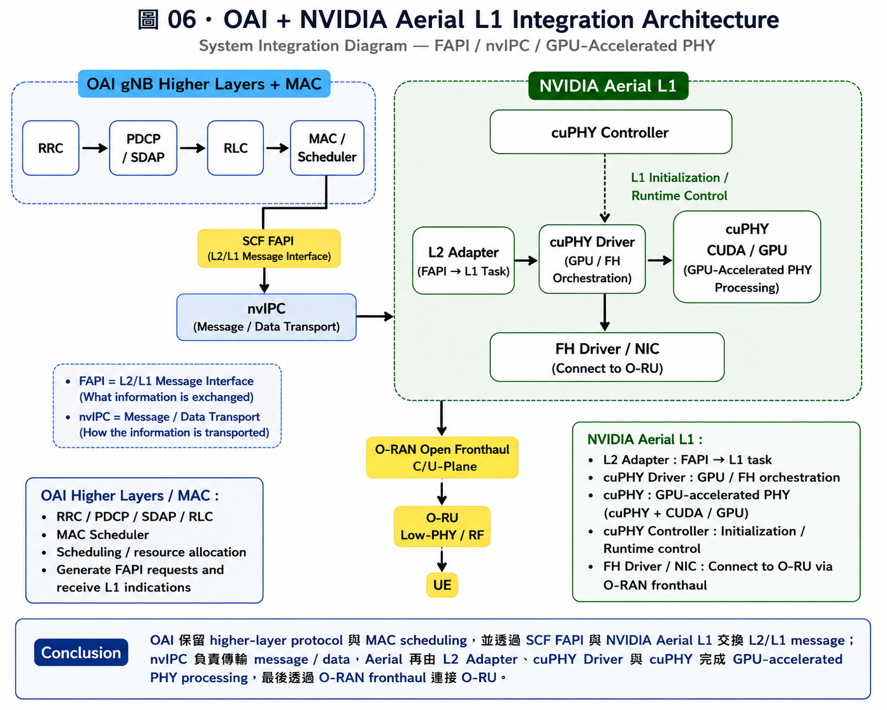

# 05. OAI Higher Layers + NVIDIA Aerial L1

## 本章目標

本章的目標是理解 **OAI gNB higher layers / MAC 與 NVIDIA Aerial Layer 1 的整合架構**，並釐清：

- OAI Higher Layers / MAC
- SCF FAPI
- nvIPC
- NVIDIA Aerial L2 Adapter
- cuPHY Driver
- cuPHY
- cuPHY Controller
- O-RAN Fronthaul
- O-RU

各自扮演的角色。

本章同時希望回答以下問題：

1. OAI 與 NVIDIA Aerial 的 integration boundary 在哪裡？
2. FAPI 與 nvIPC 的角色有什麼不同？
3. OAI MAC Scheduler 的 scheduling result 如何傳到 NVIDIA Aerial L1？
4. NVIDIA Aerial 如何利用 GPU 完成 PHY processing？
5. Aerial L1 如何進一步透過 fronthaul 連接 O-RU？
6. 使用相同 FAPI interface 是否代表 OAI 與 Aerial 一定可以直接相容？

---

## 學習紀錄

- **初次學習日期：** 2026/08/24
- **初次投入時間：** 約 2.5 小時
- **本次核實日期：** 2026/09/02
- **OAI Repository：** `openairinterface5g`
- **OAI Branch：** `develop`
- **OAI Commit SHA：** `待實際 checkout / source trace 後填入`
- **主要閱讀內容：**
  - OpenAirInterface5G official source code
  - OAI Aerial FAPI Split related documentation
  - NVIDIA Aerial L1 Software Architecture
  - NVIDIA L2 Adapter / cuPHY Driver documentation
  - Small Cell Forum FAPI documentation
- **本次重點：**
  - 區分 FAPI 與 nvIPC
  - 確認 OAI MAC 與 Aerial L1 的 integration boundary
  - 確認 L2 Adapter、cuPHY Driver、cuPHY 與 cuPHY Controller 的角色
  - 確認 Aerial L1 與 O-RU 之間的 fronthaul relationship
  - 建立後續 source code trace 與 runtime verification 的方向

---

# 5.1 Overview

前一章已經整理 OAI MAC 與 PHY 之間的基本關係：

```text
MAC Scheduler
     ↓
Scheduling Decision
     ↓
FAPI
     ↓
PHY
```

OAI 本身具有自己的 PHY implementation，因此一般情況下可以理解為：

```text
OAI Higher Layers / MAC
          │
          │
        FAPI
          │
          ▼
       OAI PHY
          │
          ▼
        Radio
```

但是 5G PHY 包含大量計算密集的處理，例如：

- Channel Coding / Decoding
- Modulation / Demodulation
- Channel Estimation
- MIMO Processing
- Physical Channel Processing

因此另一種 integration approach 是：

> 保留 OAI 的 higher-layer protocol 與 MAC scheduling functionality，
> 將 Layer 1 / PHY implementation 改由 NVIDIA Aerial 執行。

概念上可以表示為：

```text
OAI Higher Layers + MAC
          │
          │ SCF FAPI
          ▼
        nvIPC
          │
          ▼
 NVIDIA Aerial L1
          │
          ▼
        cuPHY
          │
          ▼
     NVIDIA GPU
```

本章主要研究的就是這條 integration path。

---

# 5.2 Overall Architecture

OAI 與 NVIDIA Aerial L1 的整合可以先簡化為：

```text
              OAI gNB

      RRC / PDCP / SDAP
              │
             RLC
              │
             MAC
              │
         MAC Scheduler
              │
              │
           SCF FAPI
              │
              ▼
            nvIPC

================ L2 / L1 Boundary ================

              │
              ▼
      NVIDIA L2 Adapter
              │
              ▼
        cuPHY Driver
              │
              ▼
            cuPHY
              │
              ▼
         CUDA / GPU
              │
              ▼
      FH Driver / NIC
              │
              ▼
    O-RAN Open Fronthaul
              │
              ▼
             O-RU
              │
              ▼
              UE
```

這個架構可以分成兩個主要區域。

---

## OAI Higher Layers / MAC

OAI 端主要保留：

```text
RRC
 ↓
PDCP / SDAP
 ↓
RLC
 ↓
MAC
 ↓
Scheduler
```

其中 MAC Scheduler 負責 scheduling decision 與 radio resource allocation。

---

## NVIDIA Aerial L1

NVIDIA Aerial L1 主要包含：

```text
Aerial L1
│
├── L2 Adapter
├── cuPHY Driver
├── cuPHY
└── cuPHY Controller
```

並搭配：

```text
FH Driver / NIC
        ↓
O-RAN Fronthaul
        ↓
O-RU
```

完成 GPU-accelerated PHY 與 radio-side communication。

---

# 5.3 Figure 06 — OAI + NVIDIA Aerial Integration Architecture



## Figure Type

**System Integration Diagram**

Figure 06 的目的不是描述完整 protocol stack，而是呈現：

```text
OAI
 ↓
MAC-PHY Integration Boundary
 ↓
NVIDIA Aerial L1
 ↓
O-RAN Fronthaul
 ↓
O-RU
```

以及不同 software component 之間的責任分工。

---

## Figure 06 修改方向

新版 Figure 06 建議使用以下 architecture：

```text
┌────────── OAI gNB Higher Layers + MAC ──────────┐
│                                                 │
│    RRC → PDCP / SDAP → RLC → MAC / Scheduler    │
│                    │                            │
└────────────────────┼────────────────────────────┘
                     │
                  SCF FAPI
                     │
                     ▼
              ┌──────────────┐
              │    nvIPC     │
              │IPC Transport │
              └──────┬───────┘
                     │
                     ▼
┌────────────── NVIDIA Aerial L1 ──────────────────┐
│                                                  │
│              cuPHY Controller                    │
│                    │                             │
│                    ▼                             │
│   L2 Adapter → cuPHY Driver → cuPHY → CUDA/GPU   │
│                    │                             │
│                    ▼                             │
│              FH Driver / NIC                     │
│                    │                             │
└────────────────────┼─────────────────────────────┘
                     │
            O-RAN Open Fronthaul
                C/U-Plane
                     │
                     ▼
                   O-RU
              Low-PHY / RF
                     │
                     ▼
                    UE
```

這張圖特別要避免把：

```text
FAPI over nvIPC
```

當成單一 protocol。

比較正確的理解為：

```text
FAPI
=
L2 / L1 message interface
```

而：

```text
nvIPC
=
message / data transport mechanism
```

---

# 5.4 What Remains in OAI?

接上 NVIDIA Aerial L1 後，OAI 並不是整套被取代。

OAI 仍然負責 higher-layer protocol 與 MAC scheduling。

```text
RRC
 ↓
PDCP / SDAP
 ↓
RLC
 ↓
MAC
 ↓
Scheduler
```

其中 MAC Scheduler 仍然在 OAI 中。

Scheduler 主要負責決定：

- UE selection
- Radio Resource
- MCS
- HARQ
- Time-domain Allocation
- Frequency-domain Resource Allocation

概念上：

```text
OAI MAC Scheduler
        ↓
Scheduling Decision
        ↓
FAPI Structures
        ↓
Layer 1
```

因此 NVIDIA Aerial L1 並不是重新做 MAC scheduling。

可以整理成：

```text
OAI
↓
Decide what should be transmitted
```

```text
Aerial L1
↓
Execute the required PHY processing
```

---

# 5.5 NVIDIA Aerial L1 Components

根據 NVIDIA Aerial official documentation，Aerial L1 software stack 主要包含：

```text
Aerial L1
│
├── L2 Adapter
├── cuPHY Driver
├── cuPHY
└── cuPHY Controller
```

官方文件指出，L2 與 L1 之間透過 `nvIPC` interface，並使用 FAPI communication。

Reference：

- [NVIDIA Aerial — Overview](https://docs.nvidia.com/aerial/aerial-cuphy/current/text/overview.html)
- [NVIDIA Aerial — L2 Adapter](https://docs.nvidia.com/aerial/aerial-cuphy/current/text/l2_adapter.html)

---

## 5.5.1 L2 Adapter

L2 Adapter 位於 L2 與 NVIDIA Aerial L1 之間。

它主要將：

```text
SCF FAPI Command
        ↓
    L2 Adapter
        ↓
      L1 Task
```

也就是將 L2 傳來的 FAPI slot commands 轉換成 Aerial L1 可以執行的 task。

NVIDIA 官方文件也指出 L2 Adapter 使用 `nvIPC` library 傳輸 L1 / L2 間的 message 與 data。

---

## 5.5.2 cuPHY Driver

cuPHY Driver 主要負責 orchestrate GPU 與 fronthaul processing。

其主要工作包括：

- Processing L1 tasks
- Starting DL / UL cuPHY tasks
- Launching GPU workloads
- Managing data movement
- Coordinating cuPHY and fronthaul
- Returning L1 indication results toward L2

概念：

```text
L2 Adapter
     ↓
cuPHY Driver
     ↓
 ┌───┴────┐
 ↓        ↓
cuPHY   Fronthaul
```

因此 cuPHY Driver 不只是單純「呼叫 cuPHY」，而是 Aerial L1 runtime orchestration 的重要 component。

---

## 5.5.3 cuPHY

`cuPHY` 是 NVIDIA GPU-accelerated PHY implementation / library。

主要負責執行實際的 5G PHY processing。

例如：

```text
PHY Task
   ↓
cuPHY
   ↓
CUDA Kernels
   ↓
NVIDIA GPU
```

因此大量 PHY workload 可以利用 GPU parallel processing capability。

---

## 5.5.4 cuPHY Controller

cuPHY Controller 是 Aerial L1 的主要 control application。

NVIDIA 官方文件指出它負責初始化：

- Cell configuration
- Fronthaul buffers
- L1 control threads

因此它主要處理 L1 system initialization 與 runtime control environment。

概念：

```text
cuPHY Controller
       ↓
Initialize / Configure
       ↓
Aerial L1 Runtime
```

---

# 5.6 Role of FAPI

OAI MAC 與 NVIDIA Aerial L1 之間最重要的 standard interface 是：

```text
FAPI
```

FAPI 由 Small Cell Forum 定義，主要提供 MAC / higher layer 與 PHY 之間的 interface。

Reference：

- [Small Cell Forum — 5G FAPI Standard](https://www.smallcellforum.org/technology/5g-fapi-standard/)

FAPI 可以先理解為：

> 定義 MAC 與 PHY 之間需要交換哪些 control / data information。

例如 MAC → PHY：

```text
DL_TTI.request
UL_TTI.request
TX_DATA.request
```

PHY → MAC：

```text
SLOT.indication
RX_DATA.indication
CRC.indication
UCI.indication
```

概念：

```text
OAI MAC Scheduler
        ↓
   FAPI Request
        ↓
 NVIDIA Aerial L1
```

以及：

```text
NVIDIA Aerial L1
        ↓
  FAPI Indication
        ↓
     OAI MAC
```

---

## FAPI 的角色

FAPI 定義的是：

```text
What information is exchanged
```

例如：

- Scheduling information
- PDU configuration
- Payload information
- RX result
- CRC result
- UCI result

因此 OAI MAC 不需要知道 Aerial 內部 CUDA kernel 如何實作。

OAI 只需要按照 L2 / L1 interface 提供 Layer 1 執行 PHY 所需要的資訊。

---

# 5.7 Role of nvIPC

FAPI 定義了：

```text
MAC ↔ PHY
What information is exchanged
```

但是 message 與 transport block data 還需要真正從 L2 傳到 Aerial L1。

NVIDIA Aerial 在這裡使用：

```text
nvIPC
```

NVIDIA 官方文件指出：

> L2 / L1 interface goes through nvIPC，並使用 FAPI communication。

因此可以整理成：

```text
OAI MAC
   │
FAPI Message
   │
   ▼
 nvIPC
   │
   ▼
Aerial L2 Adapter
```

最重要的概念區分為：

```text
FAPI
=
Message definition / interface semantics
```

```text
nvIPC
=
Message and data transport
```

因此 FAPI 與 nvIPC 不應該被視為同一層的概念。

---

# 5.8 OAI Southbound / Aerial Integration

OAI 在與 external L1 integration 時，需要有 southbound mechanism 將 MAC / FAPI data 送往不同的 PHY implementation。

OAI source code 與 Aerial integration 需要進一步確認：

```text
OAI MAC
   ↓
Southbound Interface
   ↓
FAPI / Transport
   ↓
External L1
```

目前 repository 使用：

- [OpenAirInterface5G Official Repository](https://gitlab.eurecom.fr/oai/openairinterface5g)

- **Branch：** `develop`
- **Commit SHA：** `待實際 source trace 後填入`

由於 `develop` branch 持續更新，因此後續 source code analysis 不應只記錄：

```text
develop
```

而應固定：

```text
Repository
Branch
Commit SHA
File
Function
Checked Date
```

---

# 5.9 Downlink Data Flow

Downlink 可以從 OAI MAC Scheduler 開始理解。

首先 Scheduler 決定 transmission configuration：

```text
OAI MAC Scheduler
        ↓
Scheduling Decision
        ↓
DL_TTI.request
+
TX_DATA.request
```

接著：

```text
DL_TTI.request
TX_DATA.request
        ↓
      SCF FAPI
        ↓
       nvIPC
        ↓
Aerial L2 Adapter
        ↓
cuPHY Driver
        ↓
      cuPHY
        ↓
   CUDA / GPU
```

PHY processing 完成後，再進入 radio-side processing：

```text
GPU PHY Processing
       ↓
FH Driver / NIC
       ↓
O-RAN Fronthaul
       ↓
      O-RU
       ↓
       RF
       ↓
       UE
```

因此完整 Downlink path 可以整理成：

```text
RLC Buffer
    ↓
OAI MAC Scheduler
    ↓
DL_TTI.request
TX_DATA.request
    ↓
SCF FAPI
    ↓
nvIPC
    ↓
Aerial L2 Adapter
    ↓
cuPHY Driver
    ↓
cuPHY
    ↓
CUDA / GPU
    ↓
FH Driver
    ↓
O-RAN Fronthaul
    ↓
O-RU
    ↓
UE
```

---

# 5.10 Uplink Data Flow

Uplink 則需要先由 MAC Scheduler 配置未來的 UL resources。

概念上：

```text
OAI MAC Scheduler
        ↓
UL_TTI.request
        ↓
SCF FAPI
        ↓
nvIPC
        ↓
Aerial L1
```

這讓 L1 知道在指定 slot 中需要準備接收哪些 UL transmission。

UE 真正送出 uplink transmission 後：

```text
UE
 ↓
O-RU
 ↓
O-RAN Fronthaul
 ↓
Aerial L1
 ↓
cuPHY / GPU Processing
```

PHY 完成接收與 decoding 後，會向 MAC 提供相關 indication，例如：

```text
RX_DATA.indication
CRC.indication
UCI.indication
```

因此概念上的 UL path 可以表示為：

```text
UE
 ↓
O-RU
 ↓
Fronthaul
 ↓
Aerial cuPHY
 ↓
GPU PHY Processing
 ↓
FAPI Indication
 ↓
nvIPC
 ↓
OAI MAC
 ↓
RLC / Higher Layers
```

---

# 5.11 Why GPU for PHY?

5G PHY 中有大量適合 parallel processing 的 workload，例如：

- LDPC Encoding / Decoding
- MIMO Processing
- Channel Estimation
- Modulation / Demodulation
- Physical Channel Processing

同一個 system 中還可能同時需要處理：

```text
Multiple UEs
Multiple Antennas
Multiple PRBs
Multiple Code Blocks
```

因此可以形成大量 parallel workload。

概念：

```text
PHY Workload
     ↓
Parallel Processing
     ↓
CUDA
     ↓
NVIDIA GPU
```

因此 OAI 與 Aerial 的分工可以先簡化為：

```text
CPU / OAI
↓
Protocol Processing
+
Scheduling
```

以及：

```text
GPU / Aerial
↓
Compute-intensive PHY Processing
```

---

# 5.12 FAPI vs O-RAN Fronthaul

FAPI 與 O-RAN Open Fronthaul 是兩個不同位置的 interface。

完整位置可以理解為：

```text
OAI MAC
   │
   │ FAPI
   ▼
Aerial L1
   │
   │ O-RAN Fronthaul
   ▼
 O-RU
```

因此：

```text
FAPI
=
MAC ↔ PHY
```

而：

```text
O-RAN Fronthaul
=
Upper-PHY / O-DU side ↔ O-RU
```

在 NVIDIA Aerial / O-RAN lower-layer split context 中，可以簡化為：

```text
Aerial L1
Upper-PHY side
      │
      │ O-RAN Open Fronthaul
      ▼
    O-RU
Low-PHY / RF
```

需要注意：

> 這是特定 O-RAN lower-layer functional split context，
> 並不代表所有 gNB implementation 都使用完全相同的 DU / RU functional split。

---

# 5.13 Real-Time Timing

OAI + NVIDIA Aerial integration 的重要問題之一是：

```text
Real-Time Timing
```

RAN system 不只是要求：

```text
Message eventually arrives
```

而是要求：

```text
Message arrives and processing finishes
before the required radio deadline
```

整條 pipeline：

```text
Slot Timing
    ↓
OAI Scheduler
    ↓
FAPI
    ↓
nvIPC
    ↓
Aerial L1
    ↓
GPU Processing
    ↓
Fronthaul
    ↓
O-RU Transmission
```

都需要在 radio timing requirement 內完成。

因此系統 correctness 不只是：

```text
Correct Result
```

而是：

```text
Correct Result
+
Correct Timing
```

---

# 5.14 FAPI Version Compatibility

另一個重要 integration issue 是：

```text
FAPI Version Compatibility
```

即使：

```text
OAI supports FAPI
```

且：

```text
Aerial supports FAPI
```

也不能直接推出：

```text
OAI ↔ Aerial
一定完全相容
```

實際 integration 還需要確認：

- FAPI specification version
- Message definition
- PDU definition
- Field definition
- Optional field support
- Structure layout
- Vendor / implementation extension
- Transport implementation

因此：

> 使用相同 standard interface 只是 integration 的基礎，
> 實際 software version 與 interface definition 仍然必須互相匹配。

---

# 5.15 Data Movement

GPU acceleration 的 performance 不只取決於 GPU compute capability。

還需要考慮：

```text
CPU
 ↓
Data Movement
 ↓
GPU
```

以及：

```text
L2
 ↓
nvIPC
 ↓
GPU / PHY
 ↓
NIC / Fronthaul
```

如果大量時間消耗在：

- Memory Copy
- Buffer Management
- IPC
- Host / Device Transfer
- NIC Transfer

GPU acceleration 的整體效益可能下降。

因此 integration performance 應該從：

```text
Computation
+
Data Movement
+
Timing
```

三個角度一起評估。

---

# 5.16 Verification & References

本章不只使用概念圖整理 OAI + Aerial integration，而是分別使用：

```text
Official Standard
        ↓
Official Documentation
        ↓
Source Code
        ↓
Runtime Verification
```

進行核實。

---

## 5.16.1 NVIDIA Aerial — Software Architecture

- [NVIDIA Aerial — Overview](https://docs.nvidia.com/aerial/aerial-cuphy/current/text/overview.html)
- **Document Type：** NVIDIA Official Documentation
- **Document Channel：** Current Aerial Documentation
- **Checked Date：** 2026/09/02

### 用於核實

主要核實：

- Aerial L1 software stack
- L2 Adapter
- cuPHY Driver
- cuPHY
- cuPHY Controller
- nvIPC
- O-RU / Low-PHY relationship

根據 NVIDIA 官方文件，Aerial L1 stack 包含：

```text
L2 Adapter
cuPHY Driver
cuPHY
cuPHY Controller
```

並且：

```text
L2 ↔ L1
uses FAPI
through nvIPC
```

:contentReference[oaicite:0]{index=0}

---

## 5.16.2 NVIDIA Aerial — L2 Adapter / cuPHY Driver

- [NVIDIA Aerial — L2 Adapter](https://docs.nvidia.com/aerial/aerial-cuphy/current/text/l2_adapter.html)
- **Document Type：** NVIDIA Official Documentation
- **Checked Date：** 2026/09/02

### 用於核實

主要核實：

```text
SCF FAPI
   ↓
L2 Adapter
   ↓
L1 Task
   ↓
cuPHY Driver
```

以及：

- nvIPC message/data transport
- cuPHY Driver GPU orchestration
- Fronthaul processing
- FAPI indications back toward L2

NVIDIA 官方文件明確說明 L2 Adapter 會將 SCF FAPI commands 轉換為 cuPHY tasks，並利用 nvIPC transport L1 / L2 message 與 data；cuPHY Driver 則負責協調 GPU 與 fronthaul 工作。 :contentReference[oaicite:1]{index=1}

---

## 5.16.3 Small Cell Forum — FAPI

- [Small Cell Forum — 5G FAPI Standard](https://www.smallcellforum.org/technology/5g-fapi-standard/)
- **Specification Family：** SCF FAPI
- **主要文件：** SCF222 — 5G FAPI PHY API
- **Checked Date：** 2026/09/02

### 用於核實

主要核實：

```text
MAC / Higher Layer
        ↕
       FAPI
        ↕
       PHY
```

以及 FAPI message interface 的定位。

後續進行更詳細 message-level trace 時，需要記錄實際使用的 SCF222 document edition / version。

---

## 5.16.4 OpenAirInterface

- [OpenAirInterface5G — Official Repository](https://gitlab.eurecom.fr/oai/openairinterface5g)
- **Repository：** `openairinterface5g`
- **Branch：** `develop`
- **Commit SHA：** `待實際 checkout / source trace 後填入`
- **Checked Date：** `待 source trace 後更新`

OAI 官方 GitLab 的主要 development branch 為 `develop`。 :contentReference[oaicite:2]{index=2}

### 用於核實

後續需要從 OAI source code 實際確認：

```text
MAC Scheduler
     ↓
FAPI Structures
     ↓
Southbound Interface
     ↓
Aerial / External L1
```

預計 trace：

- FAPI data structures
- MAC scheduling output
- DL / UL request generation
- Aerial southbound integration
- nvIPC-related integration

由於 `develop` branch 會持續更新，因此最終 source code analysis 必須固定：

```text
Branch
+
Commit SHA
```

才能重現研究結果。

---

# 5.17 Verification Status

目前可以將本章內容分成三個 verification level。

| 內容 | Verification Status | 主要來源 |
|---|---|---|
| Aerial L1 components | Verified | NVIDIA official documentation |
| FAPI / nvIPC role | Verified | NVIDIA + SCF documentation |
| cuPHY Driver role | Verified | NVIDIA official documentation |
| cuPHY Controller role | Verified | NVIDIA official documentation |
| O-RU / Low-PHY relationship | Verified in Aerial architecture context | NVIDIA official documentation |
| FAPI MAC-PHY positioning | Verified | Small Cell Forum |
| OAI `develop` repository | Verified | OAI official GitLab |
| OAI specific Aerial source-code path | Pending source trace | OAI source code |
| Exact OAI ↔ Aerial FAPI compatibility | Pending runtime / version verification | OAI + NVIDIA environment |
| Real-time performance | Pending runtime measurement | Experimental verification |

這個區分非常重要。

目前不能只因為 architecture diagram 看起來合理，就宣稱所有 implementation detail 都已經 verified。

---

# 5.18 Research Conclusion

經過官方 documentation 與目前 source-code-level research path 的整理，本章得到以下結論。

## Conclusion 1 — Integration Boundary

OAI 與 NVIDIA Aerial 的主要 integration boundary 位於：

```text
MAC
 ↕
PHY
```

也就是 L2 / L1 boundary。

OAI 保留 higher-layer protocol 與 MAC scheduling functionality，而 NVIDIA Aerial 提供 GPU-accelerated PHY implementation。

---

## Conclusion 2 — FAPI 與 nvIPC 是不同層次

FAPI 與 nvIPC 不能視為同一個 protocol。

```text
FAPI
↓
Defines what L2/L1 information is exchanged
```

而：

```text
nvIPC
↓
Transports the messages and data
```

因此：

```text
SCF FAPI
        ↓
      nvIPC
        ↓
Aerial L2 Adapter
```

比單純寫：

```text
FAPI over nvIPC
```

更能清楚表達兩者角色。

---

## Conclusion 3 — Aerial L1 不取代 OAI MAC Scheduler

OAI Scheduler 仍然負責：

- Scheduling
- Resource allocation
- MCS decision
- HARQ-related scheduling
- Time / frequency-domain assignment

Aerial L1 則負責：

```text
Receive L1 commands
        ↓
PHY Processing
        ↓
GPU Execution
        ↓
Fronthaul
```

因此 Aerial 的角色不是重新決定 scheduling，而是執行 Scheduler 所要求的 PHY processing。

---

## Conclusion 4 — GPU Acceleration 不只看 Kernel Speed

Aerial integration 的 performance 不只取決於：

```text
CUDA Kernel Performance
```

還會受到：

```text
FAPI Processing
+
nvIPC
+
Data Movement
+
GPU Processing
+
Fronthaul
+
Radio Timing
```

影響。

因此後續如果進行 performance research，應該分析整條 pipeline，而不是只測 GPU kernel。

---

## Conclusion 5 — Standard Interface 不等於直接相容

即使 OAI 與 NVIDIA Aerial 都支援 FAPI，也不能直接假設：

```text
OAI ↔ Aerial
完全相容
```

仍需要確認：

```text
FAPI Version
+
Message Definition
+
PDU Structure
+
Software Version
+
Runtime Configuration
```

因此真正的 integration verification 必須進入：

```text
Documentation
      ↓
Source Code
      ↓
Build
      ↓
Runtime Log
      ↓
Message Trace
```

---

# 5.19 Version Information

## NVIDIA Aerial

- **Documentation：** NVIDIA Aerial cuPHY current documentation
- **Checked Date：** 2026/09/02
- **Reference：**
  - Aerial Overview
  - L2 Adapter / cuPHY Driver

> 後續若實際使用 NVIDIA Aerial SDK，需要另外記錄 SDK Release，例如 Aerial 25-x / 26-x，而不能只寫 `current documentation`。

---

## Small Cell Forum FAPI

- **Specification Family：** SCF FAPI
- **Reference Document：** SCF222 — 5G FAPI PHY API
- **Checked Date：** 2026/09/02
- **Exact Edition：** `待實際下載閱讀文件後填入`

---

## OpenAirInterface

- **Repository：** `openairinterface5g`
- **Branch：** `develop`
- **Commit SHA：** `待實際 checkout 後填入`
- **Checked Date：** `待 source trace 後填入`

OAI development branch 會持續更新，因此後續 source trace 必須以 commit SHA 固定版本。

---

# 5.20 Update History

| Date | Version | Update |
|---|---|---|
| 2026/08/24 | v0.1 | 建立 OAI L2 + NVIDIA Aerial L1 初版學習筆記 |
| 2026/08/25 | v0.2 | 新增 Figure 06 OAI + Aerial integration architecture |
| 2026/09/02 | v0.3 | 重新區分 FAPI 與 nvIPC |
| 2026/09/02 | v0.4 | 加入 L2 Adapter、cuPHY Driver、cuPHY Controller 的官方文件核實 |
| 2026/09/02 | v0.5 | 將 FH / NIC 修正為 fronthaul-side architecture，並補充 O-RAN context |
| 2026/09/02 | v0.6 | 加入 Verification Status、Version Information 與 Research Conclusion |
| 2026/09/02 | v0.7 | 將 Figure 06 定位為 System Integration Diagram，並準備重新繪製新版架構圖 |

---

# 5.21 Next Step

本章目前已經建立：

```text
OAI Higher Layers / MAC
        ↓
SCF FAPI
        ↓
nvIPC
        ↓
NVIDIA Aerial L1
        ↓
GPU PHY
        ↓
O-RAN Fronthaul
        ↓
O-RU
```

下一階段需要從 architecture-level 理解進入 actual implementation。

預計研究流程：

```text
Official Documentation
        ↓
OAI Source Code
        ↓
FAPI Structure
        ↓
Function Call
        ↓
Aerial Integration Path
        ↓
Runtime Log
        ↓
Performance / Timing
```

首先需要固定一個 OAI commit，實際 trace：

```text
MAC Scheduler
    ↓
FAPI Request
    ↓
Southbound Interface
    ↓
Aerial / nvIPC
```

並確認：

- 哪個 source file 建立 FAPI request
- 哪個 function 將 request 交給 southbound interface
- Aerial integration 在 OAI 中對應哪些 source files
- nvIPC integration 實際如何進行
- 使用的 OAI / Aerial / FAPI version 是否互相匹配

完成 source code trace 後，再進一步進行：

```text
Build
 ↓
Run
 ↓
Collect Log
 ↓
Message Trace
 ↓
Timing Analysis
```

用 runtime evidence 驗證本章目前從 official documentation 得到的理解。
