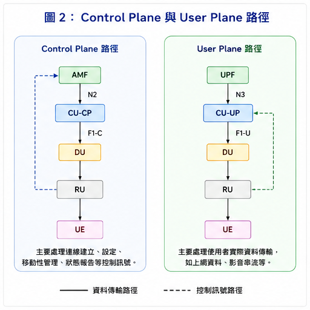
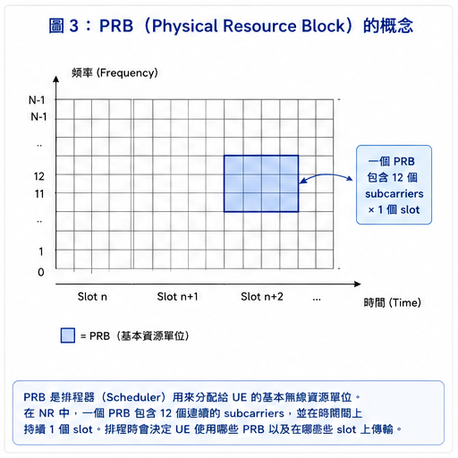
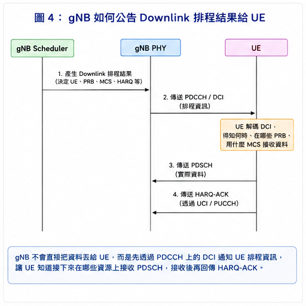
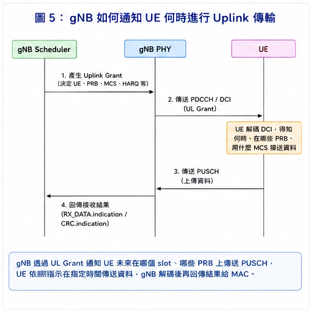
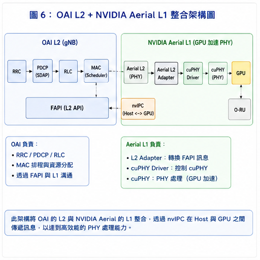

# 5G RAN Architecture Figures

這個頁面集中整理目前學習筆記中使用的主要架構圖與流程圖。  
這些圖的目的，是把 **OCUDU、OAI、MAC Scheduler、FAPI 與 NVIDIA Aerial L1** 中較抽象的概念具象化，方便快速對照各章節內容。

---

## Figure 1. CU-CP / CU-UP / DU Architecture


這張圖整理了 5G gNB 在功能拆分後的主要元件，包括 **CU-CP、CU-UP、DU 與 RU**，以及它們之間的重要介面，例如 `E1`、`F1-C` 與 `F1-U`。  
其中 **CU-CP** 主要負責控制面相關功能，**CU-UP** 主要負責使用者資料處理，而 **DU** 則負責較接近無線資源與 PHY 的處理。  
這張圖對應筆記中的 **Chapter 02：OCUDU Architecture and Interfaces**。

---

## Figure 2. Control Plane and User Plane



這張圖用來區分 **Control Plane** 與 **User Plane** 的主要路徑。  
Control Plane 主要負責 UE 的連線建立、配置與管理；User Plane 則負責實際的使用者資料傳輸，例如網頁、影音串流與封包資料。  
這張圖可以幫助理解為什麼在 5G RAN 中會進一步區分 **CU-CP** 與 **CU-UP**，並對應筆記中的 **Chapter 02：OCUDU Architecture and Interfaces**。

---

## Figure 3. PRB and Radio Resource Allocation



這張圖用來說明 **PRB（Physical Resource Block）** 與無線資源分配的基本概念。  
在 5G NR 中，PRB 可以視為 Scheduler 進行資源配置時的重要單位；MAC Scheduler 會根據 UE 狀態、channel condition、buffer 狀態與 HARQ 等資訊，決定 UE 可以使用哪些 PRBs。  
這張圖對應筆記中的 **Chapter 04：FAPI and OAI MAC Scheduler**。

---

## Figure 4. Downlink Scheduling



這張圖用來說明 **Downlink scheduling** 的基本流程，也就是 gNB 如何告知 UE 何時以及在哪些資源上接收資料。  
簡單來說，gNB 會先透過 **PDCCH / DCI** 公告排程資訊，UE 解碼後才知道後續應該在哪些資源上接收 **PDSCH**。  
這張圖對應筆記中的 **Chapter 04：FAPI and OAI MAC Scheduler**。

---

## Figure 5. Uplink Scheduling



這張圖用來說明 **Uplink scheduling** 的概念，也就是 UE 如何知道自己什麼時候可以傳送資料。  
在 Uplink 中，gNB 會先透過 **UL Grant** 告知 UE 未來應在哪個時間與哪些資源上傳送 **PUSCH**，之後 PHY 再完成接收與解碼，並將結果回報 MAC。  
這張圖對應筆記中的 **Chapter 04：FAPI and OAI MAC Scheduler**。

---

## Figure 6. OAI L2 + NVIDIA Aerial L1



這張圖整理了我目前對 **OAI Layer 2 與 NVIDIA Aerial Layer 1 整合架構**的理解。  
在這個架構中，OAI 主要負責 **RRC、PDCP、RLC、MAC 與 Scheduler**，排程結果再透過 **FAPI** 與 **nvIPC** 傳遞到 NVIDIA Aerial L1，由 **cuPHY** 使用 GPU 執行實際的 PHY processing。  
這張圖對應筆記中的 **Chapter 05：OAI L2 + NVIDIA Aerial L1**。

---

## Figure-to-Chapter Mapping

| Figure | Topic | Related Chapter |
|---|---|---|
| Figure 1 | CU-CP / CU-UP / DU Architecture | Chapter 02 |
| Figure 2 | Control Plane and User Plane | Chapter 02 |
| Figure 3 | PRB and Radio Resource Allocation | Chapter 04 |
| Figure 4 | Downlink Scheduling | Chapter 04 |
| Figure 5 | Uplink Scheduling | Chapter 04 |
| Figure 6 | OAI L2 + NVIDIA Aerial L1 | Chapter 05 |

---

## Summary

透過這些圖，我目前把整體學習脈絡整理成：

```text
5G RAN Architecture
        ↓
CU / DU / RU
        ↓
Control Plane / User Plane
        ↓
MAC Scheduler
        ↓
PRB / MCS / HARQ
        ↓
PDCCH / DCI
        ↓
FAPI
        ↓
OAI PHY / NVIDIA Aerial L1