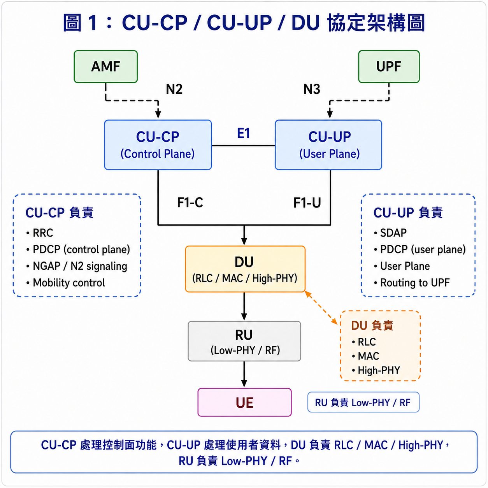
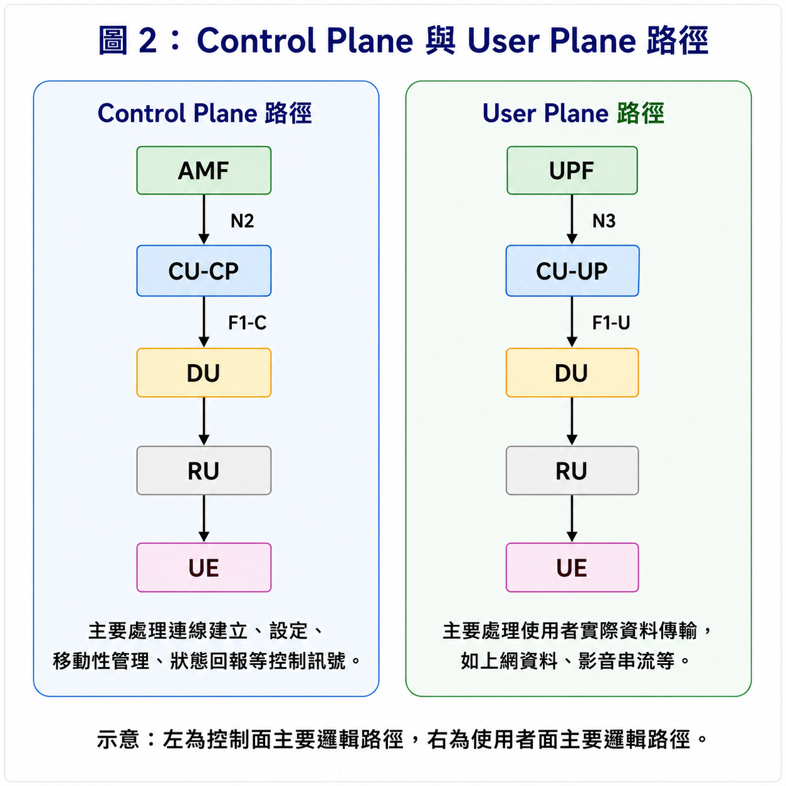
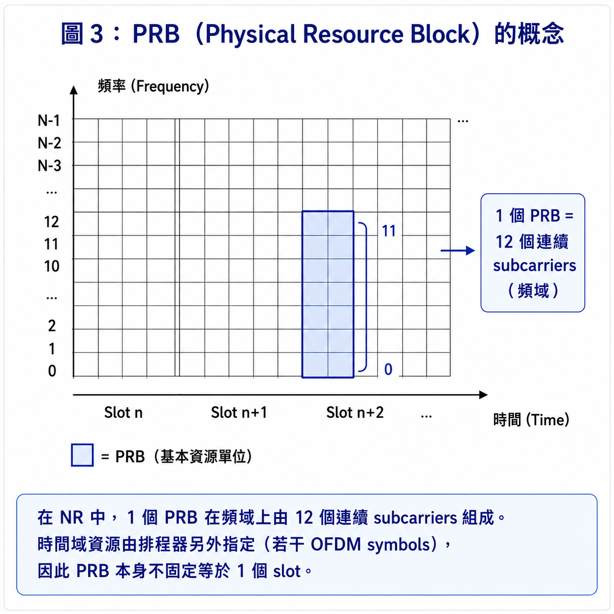
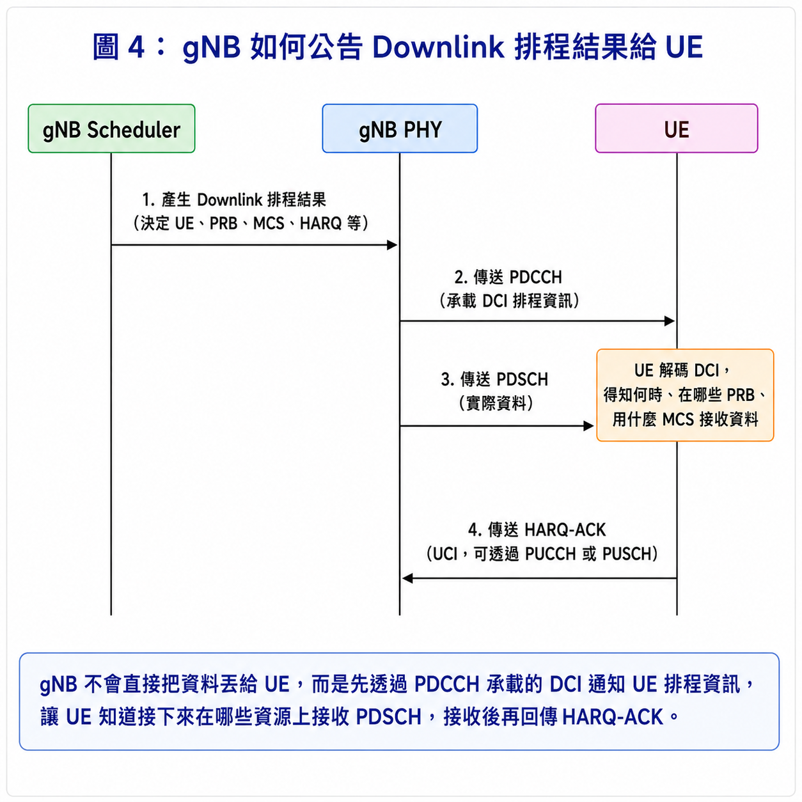
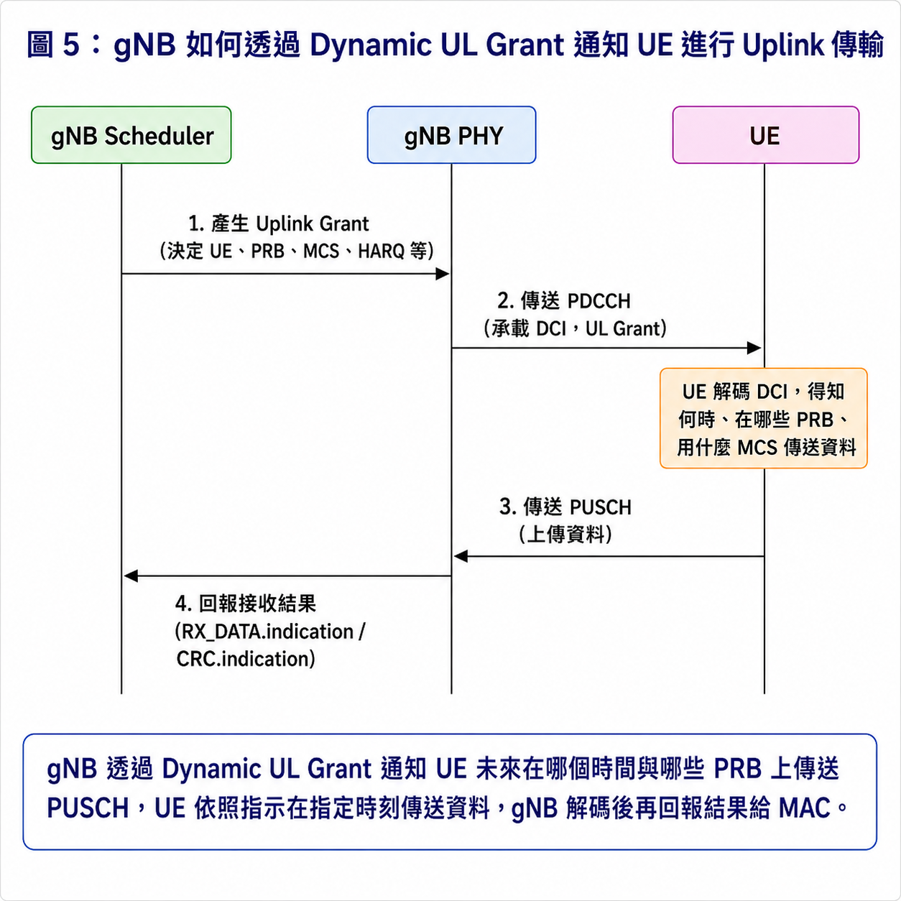
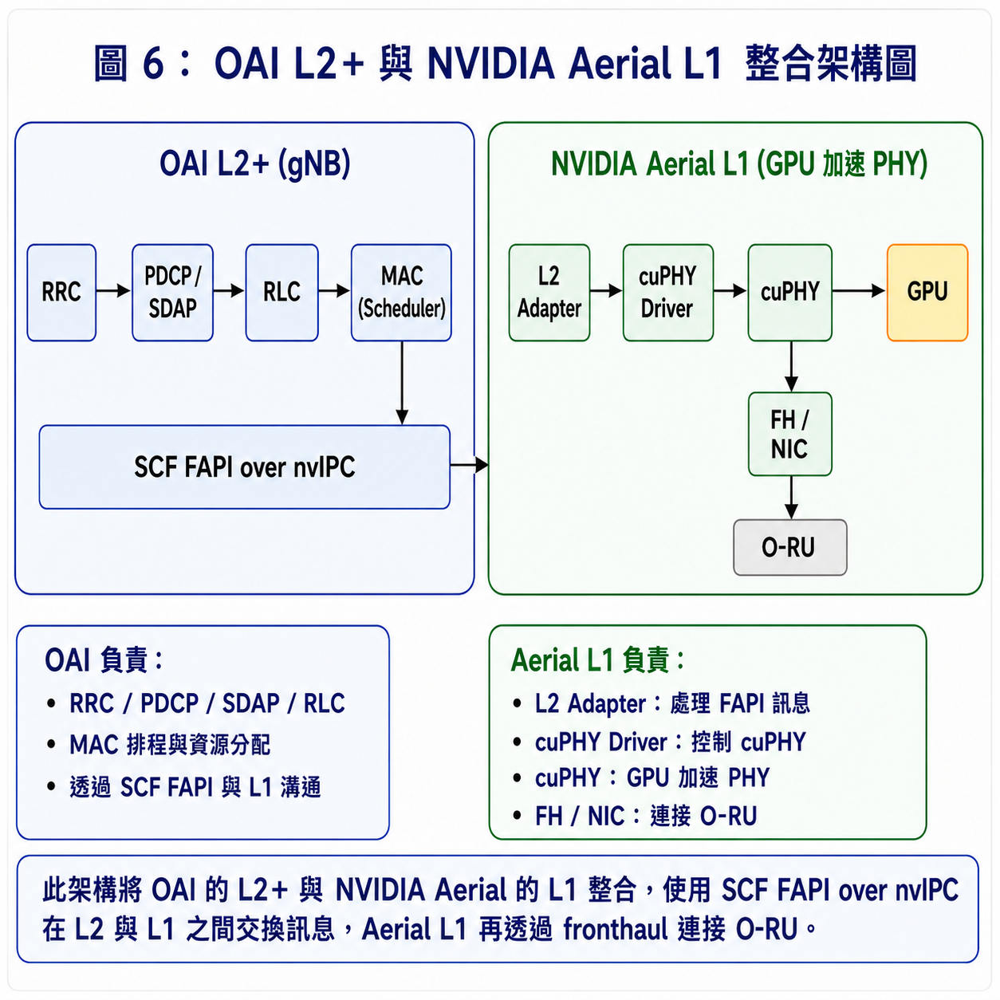
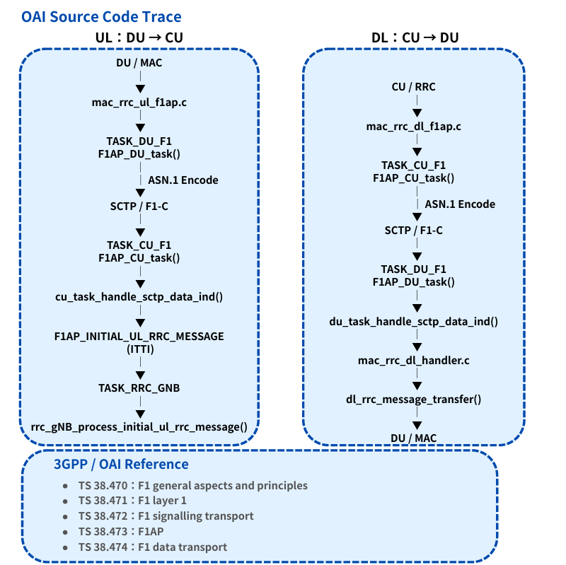
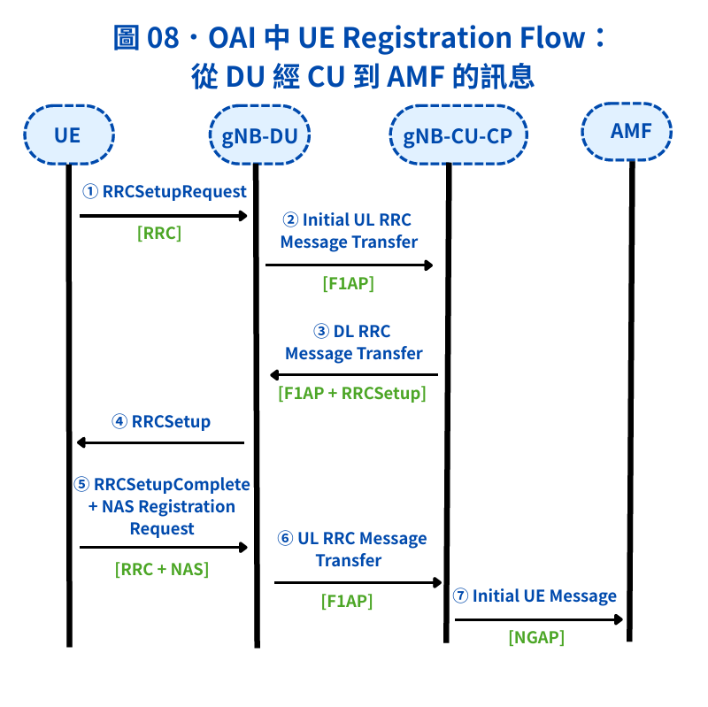
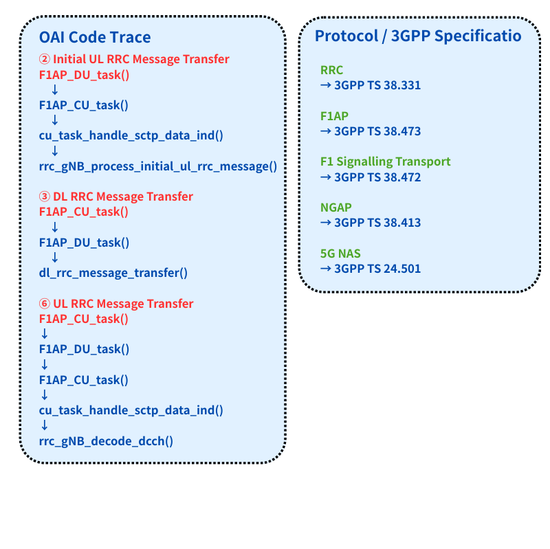

# 5G RAN Architecture Figures

這個頁面集中整理我目前學習筆記中使用的主要架構圖與流程圖。  
這些圖的目的，是把 **OCUDU、OAI、MAC Scheduler、PRB、Downlink / Uplink Scheduling，以及 NVIDIA Aerial L1** 相關概念具象化，方便快速對照各章節內容。

如果想看完整筆記，可以回到各章節閱讀；如果想先快速掌握重點概念，可以直接閱讀這一頁。

---

## Figure 1. CU-CP / CU-UP / DU 協定架構圖



這張圖整理了 5G gNB 在功能拆分後的主要元件，包括 **CU-CP、CU-UP、DU、RU 與 UE**，以及它們之間的重要介面，例如 `N2`、`N3`、`E1`、`F1-C` 與 `F1-U`。  
其中 **CU-CP** 主要負責控制面功能，例如 RRC、control-plane PDCP、NGAP / N2 signaling 與 mobility control；**CU-UP** 主要負責 SDAP、user-plane PDCP 與使用者資料傳輸；**DU** 則負責 RLC、MAC 與 High-PHY。  
這張圖對應筆記中的 **Chapter 02：OCUDU Architecture and Interfaces**。
## Figure 1 學習紀錄

- **學習日期：** 2026/08/25
- **投入時間：** 約 40 分鐘
- **修正重點：** 重新整理 CU-CP、CU-UP、DU、RU 的功能分工，以及 `N2`、`N3`、`E1`、`F1-C`、`F1-U` 等主要介面。
- **學到的內容：** 更清楚理解 Control Plane、User Plane 與 DU / RU 在 gNB functional split 中的位置。
---

## Figure 2. Control Plane 與 User Plane 路徑



這張圖用來區分 **Control Plane** 與 **User Plane** 的主要邏輯路徑。  
左側的 Control Plane 路徑主要處理連線建立、設定、移動性管理與狀態回報等控制訊號；右側的 User Plane 路徑則主要負責實際的使用者資料傳輸，例如上網資料與影音串流。  
這張圖對應筆記中的 **Chapter 02：OCUDU Architecture and Interfaces**。

## Figure 2 學習紀錄

- **學習日期：** 2026/08/25
- **投入時間：** 約 30 分鐘
- **修正重點：** 將 Control Plane 與 User Plane 拆成兩條邏輯路徑，重新整理 AMF / CU-CP 與 UPF / CU-UP 的關係。
- **學到的內容：** 更清楚理解控制訊號與使用者資料雖然最後都會經過 DU、RU 與 UE，但上層負責的功能與介面不同。

---

## Figure 3. PRB（Physical Resource Block）的概念



這張圖用來說明 **PRB（Physical Resource Block）** 的基本概念。  
在 NR 中，1 個 PRB 在**頻域**上由 **12 個連續 subcarriers** 組成，而時間域資源則由排程器另外指定，因此 PRB 本身不固定等於 1 個 slot。  
這張圖對應筆記中的 **Chapter 04：FAPI and OAI MAC Scheduler**。

## Figure 3 學習紀錄

- **學習日期：** 2026/08/25
- **投入時間：** 約 25 分鐘
- **修正重點：** 重新確認 PRB 的定義，明確標示 1 個 PRB 在頻域上由 12 個連續 subcarriers 組成，時間域資源則由 Scheduler 另外指定。
- **學到的內容：** 更清楚理解 PRB 是頻域資源單位，不能直接把 1 個 PRB 等同於 1 個 slot。

---

## Figure 4. gNB 如何透過 Downlink Scheduling 通知 UE 接收資料



這張圖用來說明 **Downlink scheduling** 的基本流程，也就是 gNB 如何告知 UE 何時以及在哪些資源上接收資料。  
簡單來說，gNB 會先透過 **PDCCH / DCI** 公告排程資訊，UE 解碼後才知道後續應該在哪些 PRBs、使用什麼 MCS 接收 **PDSCH**。  
這張圖對應筆記中的 **Chapter 04：FAPI and OAI MAC Scheduler**。

## Figure 4 學習紀錄

- **學習日期：** 2026/08/25
- **投入時間：** 約 35 分鐘
- **修正重點：** 重新整理 Downlink scheduling 流程，區分 Scheduler decision、PDCCH / DCI 與 PDSCH 的角色。
- **學到的內容：** 更清楚理解 UE 需要先解碼 PDCCH 上的 DCI，才能知道後續應在哪些資源上接收 PDSCH。

---

## Figure 5. gNB 如何透過 Dynamic UL Grant 通知 UE 進行 Uplink 傳輸



這張圖用來說明 **Uplink scheduling** 的概念，也就是 UE 如何知道自己何時、在哪些資源上傳送資料。  
在 Uplink 中，gNB 會先產生 **Uplink Grant**，並透過 **PDCCH / DCI** 通知 UE 未來應在哪些 PRBs、使用什麼 MCS 傳送 **PUSCH**；之後 gNB 解碼完成，再透過 `RX_DATA.indication` 與 `CRC.indication` 將結果回報 MAC。  
這張圖對應筆記中的 **Chapter 04：FAPI and OAI MAC Scheduler**。

## Figure 5 學習紀錄

- **學習日期：** 2026/08/25
- **投入時間：** 約 35 分鐘
- **修正重點：** 重新整理 Dynamic UL Grant 流程，補強 gNB 如何通知 UE 何時、在哪些 PRBs 上傳送 PUSCH，以及接收結果如何回報 MAC。
- **學到的內容：** 更清楚理解 Uplink transmission 不是 UE 任意傳送，而是依照 gNB 的 scheduling grant 在指定資源上進行。

---

## Figure 6. OAI L2+ 與 NVIDIA Aerial L1 整合架構圖



這張圖整理了我目前對 **OAI L2+ 與 NVIDIA Aerial L1 整合架構**的理解。  
在這個架構中，OAI 主要負責 **RRC、PDCP / SDAP、RLC 與 MAC Scheduler**，並透過 **SCF FAPI over nvIPC** 與 Aerial L1 溝通；Aerial L1 則透過 **L2 Adapter、cuPHY Driver、cuPHY 與 GPU** 執行實際的 PHY processing，最後再透過 fronthaul 連接 **O-RU**。  
這張圖對應筆記中的 **Chapter 05：OAI L2 + NVIDIA Aerial L1**。

## Figure 6 學習紀錄

- **學習日期：** 2026/08/25
- **投入時間：** 約 45 分鐘
- **修正重點：** 重新整理 OAI L2+ 與 NVIDIA Aerial L1 的模組分工，以及 `FAPI`、`nvIPC`、L2 Adapter、cuPHY Driver、cuPHY、GPU 與 O-RU 的關係。
- **學到的內容：** 更清楚理解 OAI 保留上層 protocol 與 MAC Scheduler，而 Aerial L1 負責 GPU 加速的 PHY processing。

---


## Figure 7. OAI 中 CU ↔ DU 的 F1 功能切分與協定堆疊

## Figure 7 學習紀錄

- **學習日期：** 2026/08/26
- **投入時間：** 約 1.5 小時
- **整理重點：** 將 CU / DU functional split、F1-C / F1-U protocol stack、F1 message、3GPP specification 與 OAI source code 放在同一張圖中整理。
- **學到的內容：** 更清楚理解 F1 不只是一條 CU ↔ DU interface，而是包含不同的 Control Plane 與 User Plane protocol，也開始能從 interface 往下找到 specification 與 OAI implementation。

# Figure 07 — OAI 中 CU ↔ DU 的 F1 功能切分、協定堆疊與 Source Code Trace

本組圖的目標是從 **gNB-CU / gNB-DU 功能切分**出發，進一步整理 **F1-C、F1-U 的 protocol stack**，並將重要的 F1 signaling message 對應到 OAI source code。

除了整理架構之外，也進一步從程式執行流程觀察 F1 訊息如何在 DU 與 CU 之間傳遞，並以 3GPP TS 38.470～38.474 作為 F1 interface 相關規格的閱讀依據。

---

## Figure 07-A — F1 Functional Split & Protocol Stack

.png)

### 圖片說明

此圖將 gNB-CU 進一步區分為 **CU-CP** 與 **CU-UP**，並整理 CU 與 DU 之間的兩種主要 F1 路徑。

### F1-C：Control Plane

F1-C 主要負責 CU 與 DU 之間的控制訊息。

```text
F1AP
 ↓
SCTP
 ↓
IP
```

### F1-U：User Plane

F1-U 主要負責 CU-UP 與 DU 之間的 User Plane data transport。

```text
GTP-U
 ↓
UDP
 ↓
IP
```

### CU 與 DU 的功能分工

```text
gNB-CU
├── CU-CP
│   ├── RRC
│   └── PDCP-C
│
└── CU-UP
    ├── SDAP
    └── PDCP-U

        │
        │ F1
        ↓

gNB-DU
├── RLC
├── MAC
└── PHY
```

因此 F1 並不只是一條 CU ↔ DU 的連線，而是同時包含 Control Plane 與 User Plane，而且兩者使用的 protocol stack 不同。

---

## 關鍵 F1 訊息

圖中整理的主要 F1 signaling messages 包括：

- `F1 Setup Request`
- `F1 Setup Response`
- `Initial UL RRC Message Transfer`
- `UL RRC Message Transfer`
- `DL RRC Message Transfer`
- `UE Context Setup Request`
- `UE Context Setup Response`
- `UE Context Release Command`

這些訊息可以作為後續從：

```text
3GPP Procedure
      ↓
F1AP Message
      ↓
OAI Source Code
```

進行追蹤的入口。

---

## Figure 07-B — OAI F1 Source Code Trace



### 圖片說明

此圖進一步將 F1 signaling 對應到 **OAI source code 執行流程**，並分成 Uplink 與 Downlink 兩個方向觀察。

---

## UL：DU → CU

Uplink 方向主要是在理解 DU 端產生的 RRC signaling，如何透過 F1-C 傳送到 CU。

```text
DU / MAC
   ↓
mac_rrc_ul_f1ap.c
   ↓
TASK_DU_F1
F1AP_DU_task()
   ↓
ASN.1 Encode
   ↓
SCTP / F1-C
   ↓
TASK_CU_F1
F1AP_CU_task()
   ↓
cu_task_handle_sctp_data_ind()
   ↓
F1AP_INITIAL_UL_RRC_MESSAGE
   ↓
TASK_RRC_GNB
   ↓
rrc_gNB_process_initial_ul_rrc_message()
```

### UL Flow 我的理解

這條流程可以簡化成：

```text
DU / MAC
   ↓
產生 F1AP Message
   ↓
ASN.1 Encode
   ↓
SCTP Transport
   ↓
CU 收到 F1AP Message
   ↓
交給 RRC 處理
```

也就是 DU 並不是直接呼叫 CU 的 RRC function，而是先把訊息包成 F1AP message，再透過 SCTP / F1-C 傳送到 CU。

---

## DL：CU → DU

Downlink 方向則是從 CU / RRC 開始，觀察 RRC signaling 如何經過 F1-C 傳送到 DU。

```text
CU / RRC
   ↓
mac_rrc_dl_f1ap.c
   ↓
TASK_CU_F1
F1AP_CU_task()
   ↓
ASN.1 Encode
   ↓
SCTP / F1-C
   ↓
TASK_DU_F1
F1AP_DU_task()
   ↓
du_task_handle_sctp_data_ind()
   ↓
mac_rrc_dl_handler.c
   ↓
dl_rrc_message_transfer()
   ↓
DU / MAC
```

### DL Flow 我的理解

這條流程可以簡化成：

```text
CU / RRC
   ↓
產生 F1AP Message
   ↓
ASN.1 Encode
   ↓
SCTP Transport
   ↓
DU 收到 F1AP Message
   ↓
交給 DU / MAC 處理
```

因此 UL 與 DL 的核心概念都是：

```text
Source Module
    ↓
F1AP Message
    ↓
ASN.1 Encode
    ↓
SCTP / F1-C
    ↓
Destination Module
```

---

## OAI Function 與 F1 Message 對應

目前圖中整理到的部分 function / message 對應如下：

| F1 Message | OAI Function |
|---|---|
| F1 Setup Request | `rrc_gNB_process_f1_setup_req()` |
| Initial UL RRC Message Transfer | `rrc_gNB_process_initial_ul_rrc_message()` |
| UL RRC Message Transfer | `rrc_gNB_decode_dcch()` |
| UE Context Setup Response | `rrc_CU_process_ue_context_setup_response()` |
| F1 Setup Response | `f1_setup_response()` |
| DL RRC Message Transfer | `dl_rrc_message_transfer()` |
| UE Context Setup Request | `ue_context_setup_request()` |
| UE Context Release Command | `ue_context_release_command()` |

這個表格的目的，是讓我不只知道 message 名稱，也開始嘗試找出：

```text
F1AP Message
    ↓
OAI Function
    ↓
Actual Processing
```

---

## 3GPP Specification 對應

本圖整理 F1 interface 時主要對應以下 3GPP specification：

| Specification | 主要內容 |
|---|---|
| **3GPP TS 38.470** | F1 general aspects and principles |
| **3GPP TS 38.471** | F1 layer 1 |
| **3GPP TS 38.472** | F1 signalling transport |
| **3GPP TS 38.473** | F1 Application Protocol（F1AP） |
| **3GPP TS 38.474** | F1 data transport |

因此可以依照不同問題去查不同規格。

### 如果要看 F1 架構與基本原則

```text
3GPP TS 38.470
```

### 如果要看 F1 signalling transport

```text
3GPP TS 38.472
```

### 如果要看 F1AP message / procedure

```text
3GPP TS 38.473
```

### 如果要看 F1 user-plane data transport

```text
3GPP TS 38.474
```

---

## 從規格到 OAI Source Code 的閱讀方式

目前我把閱讀方法整理成：

```text
CU / DU Architecture
        ↓
F1 Interface
        ↓
F1-C / F1-U
        ↓
Protocol Stack
        ↓
F1AP Message / Procedure
        ↓
3GPP Specification
        ↓
OAI Source Code
        ↓
Function / Task Execution
```

例如：

```text
Initial UL RRC Message Transfer
        ↓
F1AP
        ↓
3GPP TS 38.473
        ↓
F1AP_DU_task()
        ↓
F1AP_CU_task()
        ↓
cu_task_handle_sctp_data_ind()
        ↓
rrc_gNB_process_initial_ul_rrc_message()
```

這樣就可以從一個規格中的 signaling procedure，一路追到 OAI source code 實際執行的 function。

---

## 我的理解

透過這兩張圖，我不只想確認 **CU 與 DU 之間有哪些介面**，而是進一步理解介面內部實際使用哪些 protocol，以及 OAI 如何透過程式完成這些 protocol 所定義的功能。

以 F1-C 為例，可以整理成：

```text
3GPP F1AP Procedure
        ↓
F1AP Message
        ↓
OAI F1AP Task
        ↓
ASN.1 Encode / Decode
        ↓
SCTP Transport
        ↓
CU / DU Handler
        ↓
RRC / MAC Processing
```

因此後續閱讀 OAI source code 時，我希望不只是記住 function 名稱，而是能回答：

1. **這個 function 在哪一個 protocol procedure 中被使用？**
2. **它是在處理哪一個 F1AP message？**
3. **這個 message 是在哪一份 3GPP specification 中定義？**
4. **這段程式如何完成 specification 所要求的功能？**

這也是我從單純閱讀 architecture，進一步往 **Protocol → Specification → Source Code** 對應的學習方式。

---

## Figure 07 學習紀錄

- **學習日期：** 2026/08/27
- **投入時間：** 約 2 小時
- **主要閱讀內容：** F1 Functional Split、F1-C / F1-U Protocol Stack、F1AP Messages、OAI F1 Source Code、3GPP TS 38.470～38.474
- **整理重點：** 將 CU / DU 架構、F1 protocol stack、F1AP message、3GPP specification 與 OAI source code 串在一起。
- **學到的內容：** 更清楚理解 F1 interface 不只是 CU ↔ DU 的一條連線，而是包含不同 protocol、signaling procedure 與實際 source code implementation。
- **Source Trace Target：** `F1AP Message → SCTP → CU / DU Task → RRC / MAC Handler`

---

## Next Step

下一步可以從其中一個具體的 F1AP procedure 繼續往下追。

例如：

```text
Initial UL RRC Message Transfer
        ↓
3GPP TS 38.473
        ↓
確認 message IE
        ↓
OAI ASN.1 structure
        ↓
F1AP_DU_task()
        ↓
F1AP_CU_task()
        ↓
RRC processing
```

這樣可以進一步確認：

```text
Specification
      ↓
Message Format
      ↓
Source Code Structure
      ↓
Runtime Behavior
```

之間的完整對應關係。

---

## References

### 3GPP F1 Specifications

- **3GPP TS 38.470** — F1 General Aspects and Principles
- **3GPP TS 38.471** — F1 Layer 1
- **3GPP TS 38.472** — F1 Signalling Transport
- **3GPP TS 38.473** — F1 Application Protocol（F1AP）
- **3GPP TS 38.474** — F1 Data Transport

### OAI Source Code

```text
mac_rrc_ul_f1ap.c
mac_rrc_dl_f1ap.c
mac_rrc_dl_handler.c

F1AP_DU_task()
F1AP_CU_task()

cu_task_handle_sctp_data_ind()
du_task_handle_sctp_data_ind()

rrc_gNB_process_f1_setup_req()
rrc_gNB_process_initial_ul_rrc_message()
rrc_gNB_decode_dcch()
rrc_CU_process_ue_context_setup_response()

f1_setup_response()
dl_rrc_message_transfer()
ue_context_setup_request()
ue_context_release_command()
```

---

## Figure 8. OAI 中 UE Registration Flow：從 DU 經 CU 到 AMF 的訊息

## Figure 8 學習紀錄

- **學習日期：** 2026/08/26
- **投入時間：** 約 1.5 小時
- **整理重點：** 將 UE Registration 前段流程拆成 RRC、F1AP、NGAP 與 NAS，並進一步對應 OAI source code 與 3GPP specification。
- **學到的內容：** 更清楚理解 protocol stack 如何實際出現在 signaling flow 中，也開始能從 message 找到 specification，再從 specification 回到 OAI function 追蹤實作方式。

### Figure 8-1. UE Registration Signaling Flow



這張圖用一個實際的 **UE Registration Flow**，把前面分開理解的 RRC、F1AP、NGAP 與 NAS 串在一起。

整體 signaling path 可以先整理成：

```text
UE
 ↓
gNB-DU
 ↓
gNB-CU-CP
 ↓
AMF
```

主要訊息流程如下：

```text
① RRCSetupRequest
UE → gNB-DU
[RRC]

② Initial UL RRC Message Transfer
gNB-DU → gNB-CU-CP
[F1AP]

③ DL RRC Message Transfer
gNB-CU-CP → gNB-DU
[F1AP + RRCSetup]

④ RRCSetup
gNB-DU → UE
[RRC]

⑤ RRCSetupComplete
+ NAS Registration Request
UE → gNB-DU
[RRC + NAS]

⑥ UL RRC Message Transfer
gNB-DU → gNB-CU-CP
[F1AP]

⑦ Initial UE Message
gNB-CU-CP → AMF
[NGAP]
```

這張圖讓我看到：

```text
UE ↔ DU
主要使用 RRC

DU ↔ CU-CP
主要透過 F1AP 傳遞 RRC message

CU-CP ↔ AMF
透過 NGAP 傳送 Initial UE Message
```

因此 protocol stack 不只是架構圖上的名稱，而是真的會出現在 UE 建立連線的 signaling flow 中。

---

### Figure 8-2. OAI Code Trace 與 3GPP Specification 對應



這張圖進一步把 Figure 8-1 中的 signaling messages 對應到 **OAI source code** 與 **3GPP specification**。

### Initial UL RRC Message Transfer

```text
F1AP_DU_task()
        ↓
F1AP_CU_task()
        ↓
cu_task_handle_sctp_data_ind()
        ↓
rrc_gNB_process_initial_ul_rrc_message()
```

這一段主要是在觀察：

```text
DU 收到 UE RRC message
        ↓
透過 F1AP 傳給 CU
        ↓
CU 收到 F1 message
        ↓
交給 RRC processing
```

### DL RRC Message Transfer

```text
F1AP_CU_task()
        ↓
F1AP_DU_task()
        ↓
dl_rrc_message_transfer()
```

這一段則是在觀察 CU 如何透過 F1AP 將 Downlink RRC message 傳回 DU。

### UL RRC Message Transfer

```text
F1AP_CU_task()
        ↓
F1AP_DU_task()
        ↓
F1AP_CU_task()
        ↓
cu_task_handle_sctp_data_ind()
        ↓
rrc_gNB_decode_dcch()
```

這一段主要用來追蹤 UE 完成 RRC connection 後，後續 UL RRC message 如何經過 DU、F1AP 再送到 CU 處理。

### Protocol / 3GPP Specification 對應

| Protocol | 3GPP Specification |
|---|---|
| RRC | TS 38.331 |
| F1AP | TS 38.473 |
| F1 Signalling Transport | TS 38.472 |
| NGAP | TS 38.413 |
| 5G NAS | TS 24.501 |

因此 Figure 8 可以進一步整理成：

```text
Signaling Message
        ↓
Protocol
        ↓
3GPP Specification
        ↓
OAI Source Code
        ↓
Function
```

這也是目前我對「從程式去對應規格」的理解。


---
## Figure-to-Chapter Mapping

| Figure | Topic | Related Chapter |
|---|---|---|
| Figure 1 | CU-CP / CU-UP / DU 協定架構圖 | Chapter 02 |
| Figure 2 | Control Plane 與 User Plane 路徑 | Chapter 02 |
| Figure 3 | PRB（Physical Resource Block）的概念 | Chapter 04 |
| Figure 4 | Downlink Scheduling | Chapter 04 |
| Figure 5 | Uplink Scheduling | Chapter 04 |
| Figure 6 | OAI L2+ 與 NVIDIA Aerial L1 整合架構圖 | Chapter 05 |
| Figure 7 | F1 Functional Split 與 Protocol Stack | Chapter 08 |
| Figure 8 | UE Registration Flow：DU → CU → AMF | Chapter 08 |

---