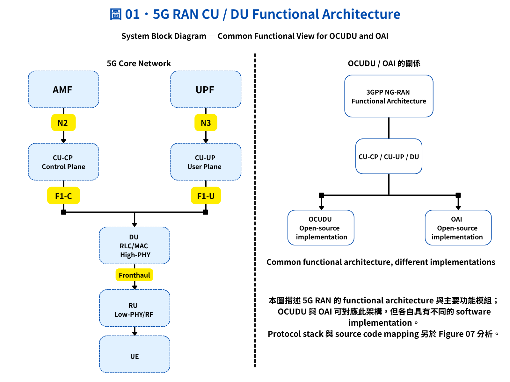

# 5G RAN Architecture Figures

這個頁面集中整理我目前學習筆記中使用的主要架構圖與流程圖。  
這些圖的目的，是把 **OCUDU、OAI、MAC Scheduler、PRB、Downlink / Uplink Scheduling，以及 NVIDIA Aerial L1** 相關概念具象化，方便快速對照各章節內容。

如果想看完整筆記，可以回到各章節閱讀；如果想先快速掌握重點概念，可以直接閱讀這一頁。

---

# Figure 01. 5G RAN CU / DU Functional Architecture

**圖表類型：** System Block Diagram｜系統方塊圖  
**研究主題：** 5G RAN Functional Architecture 與 OCUDU / OAI Implementation  
**對應章節：** Chapter 02 — OCUDU Architecture and Interfaces  
**初版日期：** 2026/08/25  
**最後更新：** 2026/09/02  

---

## 本圖目的

Figure 01 主要用來建立 **5G RAN 的 system-level functional architecture**，並進一步整理此 functional architecture 與 OCUDU / OAI open-source implementation 之間的關係。

本圖主要回答兩個問題：

1. **CU-CP、CU-UP、DU、RU 在 5G RAN 中位於什麼位置，彼此如何連接？**
2. **OCUDU 與 OAI 如何對應到共同的 5G RAN functional architecture？**

因此 Figure 01 分為：

- **Figure 01-A：CU-CP / CU-UP / DU / RU Functional Components**
- **Figure 01-B：5G RAN Functional Architecture 與 OCUDU / OAI Implementation Mapping**

Figure 01 的定位為 **System Block Diagram**。

本圖主要呈現：

```text
Functional Component
        ↓
Functional Split
        ↓
Interface Relationship
```

F1-C、F1-U 等 interface 上實際執行的 protocol stack，以及對應的 OAI source code implementation，另外於 Figure 07 進行分析。

---

# Figure 01-A. CU-CP / CU-UP / DU / RU Functional Components


## 圖片定位

Figure 01-A 用來建立 5G RAN 中主要 functional components 的基本關係。

圖中主要包含：

- AMF
- UPF
- CU-CP
- CU-UP
- DU
- RU
- UE

以及主要 interface：

- N2
- N3
- E1
- F1-C
- F1-U

本圖的目的不是完整呈現 protocol stack，而是先建立 system-level architecture：

```text
5G Core
   ↓
CU-CP / CU-UP
   ↓
DU
   ↓
Radio Side
   ↓
UE
```

---

## CU-CP

CU-CP（Central Unit — Control Plane）主要處理 Control Plane 相關功能。

目前整理的主要功能包括：

- RRC
- Control-plane PDCP
- Control signaling
- Mobility-related control

在 system-level architecture 中：

```text
AMF
 │
 N2
 │
CU-CP
```

CU-CP 透過 N2 與 5G Core 的 AMF 連接。

CU-CP 與 DU 之間則透過 F1-C 建立 Control Plane communication。

---

## CU-UP

CU-UP（Central Unit — User Plane）主要處理 User Plane 相關功能。

目前整理的主要功能包括：

- SDAP
- User-plane PDCP
- User data processing

在 system-level architecture 中：

```text
UPF
 │
 N3
 │
CU-UP
```

CU-UP 透過 N3 與 UPF 連接。

CU-UP 與 DU 之間則透過 F1-U 進行 User Plane data transmission。

---

## CU-CP 與 CU-UP

CU-CP 與 CU-UP 分別處理 Control Plane 與 User Plane 相關功能。

兩者之間透過：

```text
CU-CP
  │
  E1
  │
CU-UP
```

建立 E1 interface。

因此可以先從 system-level 將 CU 理解為：

```text
        gNB-CU
       /      \
   CU-CP      CU-UP
```

但實際 protocol stack 與 software implementation 仍需要進一步從 specification 與 source code 確認。

---

## DU

DU（Distributed Unit）位於 CU 與 radio side 之間。

Figure 01 目前主要建立：

```text
CU
 ↓
DU
 ↓
Radio Side
```

之間的 functional relationship。

Figure 01 不將所有 DU / RU deployment 視為完全相同的 implementation。

特別是 PHY functional split、DU-low、RU 與 fronthaul 的實際配置，會受到所採用的 architecture 與 implementation 影響，因此需要另外使用相對應的 specification 進行核實。

---

## Figure 01-A 的限制

Figure 01-A 中的：

```text
N2
N3
E1
F1-C
F1-U
```

主要表示 **interface 的位置與 functional relationship**。

這並不代表 Figure 01-A 已經完整描述這些 interface 上實際執行的 protocol。

例如：

```text
CU-CP
  │
 F1-C
  │
 DU
```

目前只能先確認 CU-CP 與 DU 之間存在 F1 Control Plane interface。

如果要進一步回答：

> F1-C 上實際使用哪些 protocol？

則需要繼續往下一層分析：

```text
F1-C
  ↓
Protocol
  ↓
3GPP Specification
  ↓
OAI Source Code
```

這部分另外於 Figure 07 進行分析。

---

# Figure 01-B. 5G RAN Functional Architecture 與 OCUDU / OAI Implementation Mapping



## 圖片定位

Figure 01-B 延續 Figure 01-A 的 system-level architecture，但研究問題不同。

Figure 01-A 主要回答：

> **5G RAN 有哪些主要 functional components？**

Figure 01-B 則進一步回答：

> **OCUDU 與 OAI 和這個 functional architecture 之間有什麼關係？**

因此 Figure 01-B 仍然屬於 **System Block Diagram**，而不是 Protocol Architecture Diagram。

---

## Common Functional Architecture

Figure 01-B 左側先建立 5G RAN 的主要 functional components 與 interface：

```text
AMF                       UPF
 │                         │
 N2                        N3
 │                         │
 ▼                         ▼
CU-CP ←────── E1 ──────→ CU-UP
 │                         │
F1-C                      F1-U
 └──────────┬──────────────┘
            ↓
            DU
            ↓
       Radio / Fronthaul
            ↓
            RU
            ↓
            UE
```

這一部分的目的，是建立一個 system-level reference。

也就是先理解：

```text
Core Network
     ↓
CU-CP / CU-UP
     ↓
DU
     ↓
Radio Side
     ↓
UE
```

之間的整體 functional relationship。

---

## OCUDU / OAI Implementation Mapping

Figure 01-B 右側則將 **functional architecture** 與 **open-source software implementation** 分開表示：

```text
3GPP NG-RAN
Functional Architecture
        ↓
CU-CP / CU-UP / DU
        ↓
   ┌────┴────┐
   ↓         ↓
 OCUDU      OAI
```

這裡並不是表示：

```text
OCUDU = OAI
```

而是使用共同的 5G RAN functional architecture 作為研究兩種 implementation 的 reference。

目前將兩者的關係整理為：

> **Common functional architecture, different implementations.**

也就是說，OCUDU 與 OAI 可以從共同的：

- Functional architecture
- Functional split
- Interface
- Protocol
- 3GPP specification

開始理解與比較。

但是兩者實際的：

- Software module
- Source code organization
- Function / task design
- Interface implementation
- Deployment method

仍然需要分別透過官方 documentation 與 source code 進一步確認。

---

# Verification & References

Figure 01-A 與 Figure 01-B 屬於 **System Block Diagram**。

因此 Figure 01 的 verification 主要分成：

```text
3GPP Specification
        ↓
Functional Architecture
        ↓
Open-source Documentation
        ↓
Source Code
        ↓
Implementation Comparison
```

---

## 1. 3GPP TS 38.401 — NG-RAN Architecture Description

- [3GPP TS 38.401 — NG-RAN Architecture Description](https://portal.3gpp.org/desktopmodules/Specifications/SpecificationDetails.aspx?specificationId=3219)
- **Release：** Release 19
- **Reference Version：** TS 38.401 V19.3.0
- **Checked Date：** 2026/09/02

### 對應 Figure 01 的內容

TS 38.401 主要用於核實 Figure 01-A / Figure 01-B 中的 NG-RAN functional architecture，包括：

- gNB-CU 與 gNB-DU 的 functional architecture
- gNB-CU-CP 與 gNB-CU-UP 的 separation
- CU-CP ↔ CU-UP 的 E1 interface
- CU-CP ↔ DU 的 F1-C interface
- CU-UP ↔ DU 的 F1-U interface
- NG-RAN 與 5G Core 之間的 architecture relationship

因此 Figure 01 中：

```text
             CU-CP
               │
              E1
               │
             CU-UP
              / \
          F1-C   F1-U
            \     /
               DU
```

主要是依照 TS 38.401 所定義的 NG-RAN functional architecture 進行整理。

> **Verification Note：**
> Reference Version 代表本次用於 Figure 01 verification 的規格版本。
> 若後續改用其他版本重新核實，需同步更新 Version Information 與 Update History。

---

## 2. 3GPP TS 38.470 — F1 General Aspects and Principles

- [3GPP TS 38.470 — F1 General Aspects and Principles](https://portal.3gpp.org/desktopmodules/Specifications/SpecificationDetails.aspx?specificationId=3257)
- **Release：** Release 19
- **Reference Version：** TS 38.470 V19.2.0
- **Checked Date：** 2026/09/02

### 對應 Figure 01 的內容

TS 38.470 主要用於進一步核實：

- F1 interface 位於 gNB-CU 與 gNB-DU 之間
- F1 interface 的 general architecture
- F1 Control Plane 與 User Plane 的基本概念

Figure 01 目前只使用：

```text
CU-CP ── F1-C ── DU
CU-UP ── F1-U ── DU
```

表示 system-level interface relationship。

Figure 01 並沒有使用 TS 38.470 來證明 OCUDU 與 OAI 的 software implementation 相同。

F1-C / F1-U 上實際執行的 protocol stack、F1AP procedure 與 OAI source code implementation，另外於 Figure 07 進行分析。

---

## 3. OpenAirInterface — Official Source Code

- [OpenAirInterface5G — Official GitLab Repository](https://gitlab.eurecom.fr/oai/openairinterface5g)
- **Repository：** `openairinterface5g`
- **Branch：** `develop`
- **Commit SHA：** `待實際 checkout / source trace 後填入`
- **Checked Date：** `待實際 source trace 後填入`

### 對應 Figure 01-B 的內容

OAI official source code 主要用來進一步確認：

```text
3GPP Functional Architecture
        ↓
OAI Software Architecture
        ↓
Software Module
        ↓
Source Code
```

也就是確認 OAI 如何將 5G RAN specification 中的 functional concept 實作成實際 software modules。

由於 `develop` branch 會持續更新，因此後續進行 source code trace 時，需要記錄實際使用的：

```text
Branch
Commit SHA
File
Function
Checked Date
```

避免只標示 `develop` 而無法重現當時的 source code 狀態。

---

## 4. OCUDU — Official Source Code

- [OCUDU — GitHub Repository](https://github.com/ocudu/ocudu)
- **Branch / Tag：** `待實際確認`
- **Commit SHA：** `待實際 source trace 後填入`
- **Checked Date：** `待實際 source trace 後填入`

### 對應 Figure 01-B 的內容

OCUDU source code 主要用來進一步確認：

```text
3GPP Functional Architecture
        ↓
OCUDU Software Architecture
        ↓
Software Module
        ↓
Source Code
```

Figure 01-B 將 OCUDU 與 OAI 放在共同 functional architecture 下方，主要是建立後續比較的研究架構。

這並不代表兩者的 software architecture 完全相同。

後續需要分別從兩者的：

- Source code structure
- Protocol implementation
- Module design
- Interface implementation
- Deployment architecture

進行比較。

---

# Verification Result

經過 architecture-level specification cross-check，Figure 01 目前可以得到以下結果：

1. gNB architecture 可以使用 CU / DU functional split 進行理解。
2. gNB-CU 可以進一步區分 gNB-CU-CP 與 gNB-CU-UP。
3. CU-CP 與 CU-UP 之間存在 E1 interface。
4. CU-CP 與 DU 之間使用 F1-C。
5. CU-UP 與 DU 之間使用 F1-U。
6. Figure 01 的定位為 system-level functional architecture。
7. 共同的 functional architecture 不代表 OCUDU 與 OAI 具有完全相同的 software implementation。

因此目前的研究關係整理為：

```text
          3GPP Specification
                 ↓
      NG-RAN Functional Architecture
                 ↓
          Interface / Protocol
                 ↓
        ┌────────┴────────┐
        ↓                 ↓
      OCUDU              OAI
        ↓                 ↓
   Source Code        Source Code
        ↓                 ↓
  Implementation     Implementation
        └────────┬────────┘
                 ↓
       Implementation Comparison
```

---

# Figure 01 的佐證範圍

目前 Figure 01 不應該把所有內容都宣稱由 TS 38.401 / TS 38.470 直接佐證。

需要區分：

| Figure 01 內容 | 主要佐證來源 |
|---|---|
| gNB-CU / gNB-DU architecture | 3GPP TS 38.401 |
| CU-CP / CU-UP separation | 3GPP TS 38.401 |
| E1 interface | 3GPP TS 38.401 |
| F1-C / F1-U relationship | 3GPP TS 38.401、TS 38.470 |
| OCUDU implementation | OCUDU official documentation / source code |
| OAI implementation | OAI official documentation / source code |
| OCUDU 與 OAI implementation difference | 後續 source code comparison |
| DU / RU PHY functional split | 需要額外的 fronthaul / PHY split specification 佐證 |

特別是 Figure 01 中若進一步將：

```text
DU = High-PHY
RU = Low-PHY / RF
```

視為特定 PHY split architecture，則不能只使用 TS 38.401 與 TS 38.470 進行完整佐證。

這部分需要另外確認所採用的 fronthaul / PHY split architecture，例如 O-RAN Open Fronthaul 相關 specification。

因此 Figure 01 目前主要將這一段理解為：

```text
DU
 ↓
Radio / Fronthaul
 ↓
RU
```

而不將所有 implementation 視為完全相同。

---

# Conclusion

## 1. System Architecture 與 Protocol Architecture 必須分開

Figure 01 的主要研究層級為：

```text
Component
   ↓
Functional Split
   ↓
Interface Relationship
```

因此 Figure 01 被定位為：

> **System Block Diagram**

它不負責完整表示 F1AP、SCTP、GTP-U 等 protocol stack。

---

## 2. Functional Architecture 與 Software Implementation 是不同層次

3GPP functional architecture 可以提供：

```text
CU-CP
CU-UP
DU
E1
F1-C
F1-U
```

等共同的研究 reference。

但是實際 software 如何組織並完成這些功能，需要再從 implementation 端進行確認。

---

## 3. OCUDU 與 OAI 可以使用共同架構作為比較起點

目前將兩者的關係整理為：

> **Common functional architecture, different implementations.**

這表示 OCUDU 與 OAI 可以從共同的 5G RAN functional architecture 開始研究與比較。

但不能因此直接認定：

```text
OCUDU Software Architecture
            =
OAI Software Architecture
```

---

## 4. 真正比較 OCUDU 與 OAI 需要進入 Source Code

只比較：

```text
CU-CP
CU-UP
DU
```

的方塊圖不足以判斷兩個 implementation 的差異。

因此後續研究需要繼續：

```text
Architecture
     ↓
Interface
     ↓
Protocol
     ↓
Specification
     ↓
Software Module
     ↓
Source Code
     ↓
Runtime Behavior
```

才能更具體理解 OCUDU 與 OAI 各自如何完成 specification 所定義的功能。

---

## 5. Figure 01 與 Figure 07 的研究層級不同

Figure 01：

```text
System Block Diagram
        ↓
What components are involved?
        ↓
What interfaces connect them?
        ↓
How do OCUDU / OAI relate
to this functional architecture?
```

Figure 07：

```text
Protocol Architecture
        ↓
What protocols run on F1?
        ↓
Which specification defines them?
        ↓
How does OAI implement them?
        ↓
Which source files / functions
perform these operations?
```

因此：

> **Figure 01 建立 system-level reference，Figure 07 再進一步從 Protocol → Specification → Source Code 進行分析。**

---

# Figure 01 學習紀錄

- **初次整理日期：** 2026/08/25
- **Figure 01-B 新增日期：** 2026/09/02
- **圖表類型：** System Block Diagram
- **主要閱讀內容：**
  - 5G RAN Functional Architecture
  - CU-CP / CU-UP / DU
  - E1 Interface
  - F1 Interface
  - OCUDU / OAI implementation relationship
- **Specification Reference：**
  - 3GPP TS 38.401 V19.3.0
  - 3GPP TS 38.470 V19.2.0
- **Source Code Reference：**
  - OAI `openairinterface5g`
  - OCUDU
- **本次修正重點：**
  - 保留 Figure 01-A 的 functional component 說明
  - 新增 Figure 01-B
  - 建立 5G RAN functional architecture 與 OCUDU / OAI implementation 的關係
  - 區分 System Block Diagram 與 Protocol Architecture Diagram
  - 加入 3GPP specification verification
  - 加入 official source code URL
  - 加入 version information
  - 明確標示目前可以證明與尚待 source code verification 的內容

---

# Update History

| Date | Version | Update |
|---|---|---|
| 2026/08/25 | v0.1 | 建立原始 CU-CP / CU-UP / DU / RU architecture figure |
| 2026/09/02 | v0.2 | 將 Figure 01 明確定位為 System Block Diagram |
| 2026/09/02 | v0.3 | 新增 Figure 01-B，整理 common functional architecture 與 OCUDU / OAI implementation mapping |
| 2026/09/02 | v0.4 | 加入 TS 38.401 / TS 38.470 specification verification |
| 2026/09/02 | v0.5 | 加入 OAI / OCUDU source code references、verification scope 與 research conclusion |

---

# Next Step

Figure 01 完成 system-level architecture 整理後，下一階段不再只增加相似的 system block diagram，而是往：

```text
System Architecture
        ↓
Interface
        ↓
Protocol
        ↓
Specification
        ↓
Source Code
        ↓
Runtime Verification
```

深入。

其中 F1 interface 的下一層分析放在 Figure 07：

```text
CU ↔ DU
   ↓
F1-C / F1-U
   ↓
Protocol Stack
   ↓
F1AP Procedure
   ↓
3GPP Specification
   ↓
OAI Source Code
```

後續再透過實際 OAI installation、runtime log 與 message trace，驗證目前從 specification 與 source code 得到的理解。
---

## Figure 2. Control Plane 與 User Plane 路徑


這張圖用來區分 **Control Plane** 與 **User Plane** 的主要邏輯路徑。  
左側的 Control Plane 路徑主要處理連線建立、設定、移動性管理與狀態回報等控制訊號；右側的 User Plane 路徑則主要負責實際的使用者資料傳輸，例如上網資料與影音串流。  
這張圖對應筆記中的 **Chapter 02：OCUDU Architecture and Interfaces**。

## Figure 2 學習紀錄

- **學習日期：** 2026/08/25
- **投入時間：** 約 30 分鐘
- **修正重點：** 將 Control Plane 與 User Plane 拆成兩條邏輯路徑，重新整理 AMF / CU-CP 與 UPF / CU-UP 的關係。
- **學到的內容：** 更清楚理解控制訊號與使用者資料雖然最後都會經過 DU、RU 與 UE，但上層負責的功能與介面不同。

---

## Figure 3. PRB（Physical Resource Block）的概念


這張圖用來說明 **PRB（Physical Resource Block）** 的基本概念。  
在 NR 中，1 個 PRB 在**頻域**上由 **12 個連續 subcarriers** 組成，而時間域資源則由排程器另外指定，因此 PRB 本身不固定等於 1 個 slot。  
這張圖對應筆記中的 **Chapter 04：FAPI and OAI MAC Scheduler**。

## Figure 3 學習紀錄

- **學習日期：** 2026/08/25
- **投入時間：** 約 25 分鐘
- **修正重點：** 重新確認 PRB 的定義，明確標示 1 個 PRB 在頻域上由 12 個連續 subcarriers 組成，時間域資源則由 Scheduler 另外指定。
- **學到的內容：** 更清楚理解 PRB 是頻域資源單位，不能直接把 1 個 PRB 等同於 1 個 slot。

---

## Figure 4. gNB 如何透過 Downlink Scheduling 通知 UE 接收資料


這張圖用來說明 **Downlink scheduling** 的基本流程，也就是 gNB 如何告知 UE 何時以及在哪些資源上接收資料。  
簡單來說，gNB 會先透過 **PDCCH / DCI** 公告排程資訊，UE 解碼後才知道後續應該在哪些 PRBs、使用什麼 MCS 接收 **PDSCH**。  
這張圖對應筆記中的 **Chapter 04：FAPI and OAI MAC Scheduler**。

## Figure 4 學習紀錄

- **學習日期：** 2026/08/25
- **投入時間：** 約 35 分鐘
- **修正重點：** 重新整理 Downlink scheduling 流程，區分 Scheduler decision、PDCCH / DCI 與 PDSCH 的角色。
- **學到的內容：** 更清楚理解 UE 需要先解碼 PDCCH 上的 DCI，才能知道後續應在哪些資源上接收 PDSCH。

---

## Figure 5. gNB 如何透過 Dynamic UL Grant 通知 UE 進行 Uplink 傳輸


這張圖用來說明 **Uplink scheduling** 的概念，也就是 UE 如何知道自己何時、在哪些資源上傳送資料。  
在 Uplink 中，gNB 會先產生 **Uplink Grant**，並透過 **PDCCH / DCI** 通知 UE 未來應在哪些 PRBs、使用什麼 MCS 傳送 **PUSCH**；之後 gNB 解碼完成，再透過 `RX_DATA.indication` 與 `CRC.indication` 將結果回報 MAC。  
這張圖對應筆記中的 **Chapter 04：FAPI and OAI MAC Scheduler**。

## Figure 5 學習紀錄

- **學習日期：** 2026/08/25
- **投入時間：** 約 35 分鐘
- **修正重點：** 重新整理 Dynamic UL Grant 流程，補強 gNB 如何通知 UE 何時、在哪些 PRBs 上傳送 PUSCH，以及接收結果如何回報 MAC。
- **學到的內容：** 更清楚理解 Uplink transmission 不是 UE 任意傳送，而是依照 gNB 的 scheduling grant 在指定資源上進行。

---

# Figure 06. OAI + NVIDIA Aerial L1 Integration Architecture


**圖表類型：** System Integration Diagram  
**研究主題：** OAI Higher Layers / MAC 與 NVIDIA Aerial L1 整合  
**對應章節：** Chapter 05 — OAI Higher Layers + NVIDIA Aerial L1  
**初版日期：** 2026/08/25  
**最後更新：** 2026/09/02  

---

## 圖片定位

Figure 06 用來整理 OAI higher-layer protocol / MAC 與 NVIDIA Aerial L1 之間的 integration architecture。

本圖主要回答：

1. OAI 與 NVIDIA Aerial 的 integration boundary 在哪裡？
2. FAPI 與 nvIPC 各自扮演什麼角色？
3. NVIDIA Aerial L1 內部主要包含哪些 software components？
4. GPU-accelerated PHY processing 如何進一步連接 O-RU？
5. OAI MAC Scheduler 是否會被 NVIDIA Aerial L1 取代？

本圖定位為 **System Integration Diagram**，主要描述 software component 與 interface relationship，而不是完整的 protocol stack diagram。

---

## Overall Architecture

Figure 06 的主要 integration path 可以整理為：

```text
OAI gNB Higher Layers + MAC
            ↓
         SCF FAPI
            ↓
          nvIPC
            ↓
     NVIDIA Aerial L1
            ↓
      FH Driver / NIC
            ↓
 O-RAN Open Fronthaul
            ↓
           O-RU
            ↓
            UE
```

其中 OAI 與 NVIDIA Aerial 的主要 integration boundary 位於：

```text
MAC
 ↕
PHY
```

也就是 L2 / L1 boundary。

---

## OAI Higher Layers / MAC

OAI 端主要保留：

```text
RRC
 ↓
PDCP / SDAP
 ↓
RLC
 ↓
MAC / Scheduler
```

主要負責：

- RRC / PDCP / SDAP / RLC
- MAC Scheduler
- Scheduling decision
- Radio resource allocation
- 產生 FAPI requests
- 接收 Layer 1 indications

因此 NVIDIA Aerial L1 並不是重新執行 MAC scheduling。

可以簡化成：

```text
OAI
↓
Decide what should be transmitted
```

---

## SCF FAPI

OAI MAC 與 NVIDIA Aerial L1 之間使用 SCF FAPI 作為 MAC-PHY message interface。

概念：

```text
OAI MAC
   │
   │ SCF FAPI
   ▼
Layer 1
```

FAPI 的角色可以理解為：

```text
FAPI
=
What information is exchanged
between L2 / MAC and L1 / PHY
```

例如 MAC → PHY 的 request：

```text
DL_TTI.request
UL_TTI.request
TX_DATA.request
```

以及 PHY → MAC 的 indication：

```text
SLOT.indication
RX_DATA.indication
CRC.indication
UCI.indication
```

因此 Figure 06 不再將：

```text
SCF FAPI over nvIPC
```

視為單一 protocol 名稱，而是將 FAPI 與 nvIPC 分成不同角色。

---

## nvIPC

nvIPC 負責 L2 / L1 之間的 message 與 data transport。

概念：

```text
SCF FAPI
    ↓
  nvIPC
    ↓
Aerial L2 Adapter
```

可以簡化為：

```text
FAPI
=
Message interface / semantics
```

```text
nvIPC
=
Message / data transport
```

因此 FAPI 與 nvIPC 屬於不同層次的概念。

---

## NVIDIA Aerial L1

Figure 06 中 NVIDIA Aerial L1 主要整理成：

```text
           cuPHY Controller
                  ⋮
          L1 Initialization /
            Runtime Control

L2 Adapter → cuPHY Driver → cuPHY
                              CUDA / GPU
                  │
                  ↓
           FH Driver / NIC
```

---

### L2 Adapter

L2 Adapter 主要負責將 Layer 2 傳來的 FAPI commands 轉換成 Layer 1 可以執行的 tasks。

```text
FAPI Command
     ↓
L2 Adapter
     ↓
  L1 Task
```

---

### cuPHY Driver

cuPHY Driver 主要負責 Aerial L1 runtime orchestration，包括 GPU 與 fronthaul processing 的協調。

概念：

```text
L2 Adapter
     ↓
cuPHY Driver
    /    \
   ↓      ↓
cuPHY   Fronthaul
```

---

### cuPHY / CUDA / GPU

cuPHY 負責實際的 GPU-accelerated PHY processing。

概念：

```text
PHY Task
   ↓
cuPHY
   ↓
CUDA / GPU
   ↓
PHY Processing
```

因此圖中將：

```text
cuPHY
CUDA / GPU
```

放在同一個 functional block 中，表示 cuPHY 利用 CUDA / NVIDIA GPU 執行 PHY workload，而不是把 CUDA / GPU 視為另一個獨立的 Aerial software module。

---

### cuPHY Controller

cuPHY Controller 主要負責 L1 initialization 與 runtime control。

Figure 06 使用虛線表示：

```text
cuPHY Controller
       ⋮
       ⋮ L1 Initialization /
       ⋮ Runtime Control
       ▼
Aerial L1 Runtime
```

這條虛線不是主要的 FAPI data processing path。

因此要和：

```text
L2 Adapter
    ↓
cuPHY Driver
    ↓
cuPHY
```

的主要 processing path 分開理解。

---

### FH Driver / NIC

FH Driver / NIC 位於 Aerial L1 與 O-RU 之間。

概念：

```text
Aerial L1
    ↓
FH Driver / NIC
    ↓
O-RAN Open Fronthaul
    ↓
O-RU
```

其角色主要是支援 fronthaul packet transmission / reception，連接 Aerial L1 與 O-RU。

---

## O-RAN Open Fronthaul

FAPI 與 O-RAN Open Fronthaul 是兩個不同位置的 interface。

```text
OAI MAC
   │
   │ FAPI
   ▼
Aerial L1
   │
   │ O-RAN Open Fronthaul
   ▼
 O-RU
```

因此：

```text
FAPI
=
MAC ↔ PHY
```

而：

```text
O-RAN Open Fronthaul
=
Aerial / O-DU side ↔ O-RU
```

在 Figure 06 的 Aerial / O-RAN context 中，O-RU 可以簡化標示為：

```text
O-RU
Low-PHY / RF
```

這是特定 O-RAN lower-layer split context，不代表所有 gNB implementation 都採用完全相同的 DU / RU split。

---

# Verification & References

Figure 06 的內容主要使用 NVIDIA Aerial 官方文件、Small Cell Forum FAPI 文件與 OAI official source code 進行核實。

---

## 1. NVIDIA Aerial — Software Architecture

- [NVIDIA Aerial — Overview](https://docs.nvidia.com/aerial/aerial-cuphy/current/text/overview.html)
- **Document Type：** NVIDIA Official Documentation
- **Checked Date：** 2026/09/02

### 用於核實

主要用於確認：

- NVIDIA Aerial L1 software architecture
- L2 Adapter
- cuPHY Driver
- cuPHY
- cuPHY Controller
- nvIPC
- O-RU / Low-PHY relationship

---

## 2. NVIDIA Aerial — L2 Adapter / cuPHY Driver

- [NVIDIA Aerial — L2 Adapter](https://docs.nvidia.com/aerial/aerial-cuphy/current/text/l2_adapter.html)
- **Document Type：** NVIDIA Official Documentation
- **Checked Date：** 2026/09/02

### 用於核實

主要確認：

```text
SCF FAPI
   ↓
L2 Adapter
   ↓
L1 Task
   ↓
cuPHY Driver
```

以及：

- nvIPC message / data transport
- cuPHY Driver GPU orchestration
- Fronthaul processing
- Layer 1 indication path

---

## 3. Small Cell Forum — FAPI

- [Small Cell Forum — 5G FAPI Standard](https://www.smallcellforum.org/technology/5g-fapi-standard/)
- **Specification Family：** SCF FAPI
- **Reference Document：** SCF222 — 5G FAPI PHY API
- **Checked Date：** 2026/09/02
- **Exact Edition：** `待實際下載閱讀後填入`

### 用於核實

主要確認：

```text
MAC / Higher Layer
        ↕
       FAPI
        ↕
       PHY
```

以及 FAPI 在 MAC-PHY boundary 的 interface 定位。

---

## 4. OpenAirInterface Source Code

- [OpenAirInterface5G — Official Repository](https://gitlab.eurecom.fr/oai/openairinterface5g)
- **Repository：** `openairinterface5g`
- **Branch：** `develop`
- **Commit SHA：** `待實際 checkout / source trace 後填入`
- **Checked Date：** `待實際 source trace 後填入`

### 用於核實

後續主要確認：

```text
OAI MAC Scheduler
        ↓
FAPI Structures
        ↓
Southbound Interface
        ↓
External / Aerial L1
```

並 trace：

- FAPI request generation
- FAPI data structures
- MAC scheduling output
- Aerial southbound integration
- nvIPC-related source code

由於 `develop` branch 會持續更新，因此後續 source code verification 需要使用實際 commit SHA 固定研究版本。

---

# Verification Status

| 內容 | Verification Status | 主要來源 |
|---|---|---|
| FAPI 位於 MAC-PHY interface | Verified | Small Cell Forum |
| FAPI 與 nvIPC 角色不同 | Verified | NVIDIA Aerial documentation |
| L2 Adapter role | Verified | NVIDIA Aerial documentation |
| cuPHY Driver role | Verified | NVIDIA Aerial documentation |
| cuPHY / GPU PHY processing | Verified | NVIDIA Aerial documentation |
| cuPHY Controller initialization / runtime role | Verified | NVIDIA Aerial documentation |
| FH Driver / NIC 與 O-RU relationship | Verified in Aerial context | NVIDIA Aerial documentation |
| OAI MAC 保留 scheduling functionality | Architecture-level verified | OAI architecture / source study |
| OAI specific Aerial source-code path | Pending source trace | OAI source code |
| OAI ↔ Aerial exact FAPI compatibility | Pending runtime / version verification | OAI + NVIDIA environment |

---

# Research Conclusion

經過 Figure 06 的重新整理與官方資料核實，目前可以得到以下結論。

### 1. OAI 與 NVIDIA Aerial 的主要 integration boundary 位於 MAC–PHY interface

```text
OAI Higher Layers / MAC
          ↓
        FAPI
          ↓
 NVIDIA Aerial L1
```

OAI 保留 higher-layer protocol 與 MAC scheduling functionality。

---

### 2. FAPI 與 nvIPC 是不同層次的技術

```text
FAPI
=
Defines what L2/L1 information is exchanged
```

而：

```text
nvIPC
=
Transports message and data
```

因此不能單純把兩者當成同一個 protocol。

---

### 3. NVIDIA Aerial L1 不取代 OAI MAC Scheduler

OAI 負責：

```text
Scheduling
Resource Allocation
MCS
HARQ-related decision
Time / Frequency Allocation
```

Aerial L1 則負責：

```text
Receive L1 task
      ↓
PHY Processing
      ↓
GPU Execution
      ↓
Fronthaul
```

因此兩者的核心分工可以整理為：

```text
OAI
↓
Protocol + Scheduling
```

```text
NVIDIA Aerial
↓
GPU-Accelerated PHY
```

---

### 4. Aerial integration 不只包含 GPU processing

完整的 integration path 是：

```text
OAI MAC
   ↓
FAPI
   ↓
nvIPC
   ↓
L2 Adapter
   ↓
cuPHY Driver
   ↓
cuPHY / GPU
   ↓
FH Driver / NIC
   ↓
O-RAN Fronthaul
   ↓
O-RU
```

因此系統效能不只取決於 GPU kernel，也會受到 IPC、data movement、fronthaul 與 radio timing 影響。

---

### 5. 使用相同 FAPI 不代表 OAI 與 Aerial 一定直接相容

實際 integration 還需要確認：

```text
FAPI Version
+
PDU Definition
+
Software Version
+
OAI Commit
+
Aerial SDK Version
+
Runtime Configuration
```

因此 Figure 06 目前建立的是 **architecture-level integration understanding**。

真正完成 implementation verification，仍需要進一步進行 source code trace 與 runtime test。

---

# Figure 06 學習紀錄

- **初次學習日期：** 2026/08/25
- **本次更新日期：** 2026/09/02
- **初次投入時間：** 約 45 分鐘
- **圖表類型：** System Integration Diagram
- **主要整理內容：**
  - OAI Higher Layers / MAC
  - SCF FAPI
  - nvIPC
  - NVIDIA L2 Adapter
  - cuPHY Driver
  - cuPHY / CUDA / GPU
  - cuPHY Controller
  - FH Driver / NIC
  - O-RAN Open Fronthaul
  - O-RU
- **本次修正重點：**
  - 將 `OAI L2+` 修正為 `OAI gNB Higher Layers + MAC`
  - 將 `SCF FAPI over nvIPC` 拆成 FAPI 與 nvIPC 兩個不同角色
  - 新增 cuPHY Controller
  - 將 Controller 的箭頭改成 `L1 Initialization / Runtime Control`
  - 將 L2 Adapter、cuPHY Driver、cuPHY 拆成不同 functional blocks
  - 將 cuPHY 與 CUDA / GPU 放在同一個 PHY processing block 中
  - 將 `FH / NIC` 修正為 `FH Driver / NIC`
  - 明確標示 O-RAN Open Fronthaul C/U-Plane
  - 加入官方 documentation、source code reference 與 verification status
  - 加入明確 research conclusion

---

# Version Information

## NVIDIA Aerial

- **Documentation：** NVIDIA Aerial current documentation
- **Checked Date：** 2026/09/02
- **Exact SDK Version：** `待實際安裝 / 測試後填入`

## Small Cell Forum FAPI

- **Reference：** SCF222 — 5G FAPI PHY API
- **Exact Edition：** `待實際下載閱讀後填入`
- **Checked Date：** 2026/09/02

## OpenAirInterface

- **Repository：** `openairinterface5g`
- **Branch：** `develop`
- **Commit SHA：** `待實際 checkout 後填入`
- **Checked Date：** `待 source trace 後填入`

---

# Update History

| Date | Version | Update |
|---|---|---|
| 2026/08/25 | v0.1 | 建立原始 OAI L2+ + NVIDIA Aerial L1 integration figure |
| 2026/09/02 | v0.2 | 將 Figure 06 定位為 System Integration Diagram |
| 2026/09/02 | v0.3 | 將 FAPI 與 nvIPC 分開表示 |
| 2026/09/02 | v0.4 | 新增 cuPHY Controller 與 L1 Initialization / Runtime Control |
| 2026/09/02 | v0.5 | 拆分 L2 Adapter、cuPHY Driver、cuPHY functional blocks |
| 2026/09/02 | v0.6 | 加入 FH Driver / NIC、O-RAN Open Fronthaul 與 O-RU |
| 2026/09/02 | v0.7 | 加入 official references、verification status、version information 與 research conclusion |

---

# Next Step

Figure 06 目前已經完成 architecture-level integration 整理。

下一階段需要進入：

```text
Architecture
    ↓
Official Documentation
    ↓
OAI Source Code
    ↓
FAPI Structure
    ↓
Function Call
    ↓
Aerial Integration
    ↓
Runtime Verification
```

後續將固定 OAI commit，實際追蹤：

```text
MAC Scheduler
    ↓
FAPI Request
    ↓
Southbound Interface
    ↓
Aerial / nvIPC
```

並透過 build、runtime log 與 message trace，驗證 Figure 06 所整理的 integration path。

---


## Figure 7. OAI 中 CU ↔ DU 的 F1 功能切分與協定堆疊

## Figure 7 學習紀錄

- **學習日期：** 2026/08/26
- **投入時間：** 約 1.5 小時
- **整理重點：** 將 CU / DU functional split、F1-C / F1-U protocol stack、F1 message、3GPP specification 與 OAI source code 放在同一張圖中整理。
- **學到的內容：** 更清楚理解 F1 不只是一條 CU ↔ DU interface，而是包含不同的 Control Plane 與 User Plane protocol，也開始能從 interface 往下找到 specification 與 OAI implementation。

# Figure 07 — OAI 中 CU ↔ DU 的 F1 功能切分、協定堆疊與 Source Code Trace

本組圖的目標是從 **gNB-CU / gNB-DU 功能切分**出發，進一步整理 **F1-C、F1-U 的 protocol stack**，並將重要的 F1 signaling message 對應到 OAI source code。

除了整理架構之外，也進一步從程式執行流程觀察 F1 訊息如何在 DU 與 CU 之間傳遞，並以 3GPP TS 38.470～38.474 作為 F1 interface 相關規格的閱讀依據。

---

## Figure 07-A — F1 Functional Split & Protocol Stack


### 圖片說明

此圖將 gNB-CU 進一步區分為 **CU-CP** 與 **CU-UP**，並整理 CU 與 DU 之間的兩種主要 F1 路徑。

### F1-C：Control Plane

F1-C 主要負責 CU 與 DU 之間的控制訊息。

```text
F1AP
 ↓
SCTP
 ↓
IP
```

### F1-U：User Plane

F1-U 主要負責 CU-UP 與 DU 之間的 User Plane data transport。

```text
GTP-U
 ↓
UDP
 ↓
IP
```

### CU 與 DU 的功能分工

```text
gNB-CU
├── CU-CP
│   ├── RRC
│   └── PDCP-C
│
└── CU-UP
    ├── SDAP
    └── PDCP-U

        │
        │ F1
        ↓

gNB-DU
├── RLC
├── MAC
└── PHY
```

因此 F1 並不只是一條 CU ↔ DU 的連線，而是同時包含 Control Plane 與 User Plane，而且兩者使用的 protocol stack 不同。

---

## 關鍵 F1 訊息

圖中整理的主要 F1 signaling messages 包括：

- `F1 Setup Request`
- `F1 Setup Response`
- `Initial UL RRC Message Transfer`
- `UL RRC Message Transfer`
- `DL RRC Message Transfer`
- `UE Context Setup Request`
- `UE Context Setup Response`
- `UE Context Release Command`

這些訊息可以作為後續從：

```text
3GPP Procedure
      ↓
F1AP Message
      ↓
OAI Source Code
```

進行追蹤的入口。

---

## Figure 07-B — OAI F1 Source Code Trace


### 圖片說明

此圖進一步將 F1 signaling 對應到 **OAI source code 執行流程**，並分成 Uplink 與 Downlink 兩個方向觀察。

---

## UL：DU → CU

Uplink 方向主要是在理解 DU 端產生的 RRC signaling，如何透過 F1-C 傳送到 CU。

```text
DU / MAC
   ↓
mac_rrc_ul_f1ap.c
   ↓
TASK_DU_F1
F1AP_DU_task()
   ↓
ASN.1 Encode
   ↓
SCTP / F1-C
   ↓
TASK_CU_F1
F1AP_CU_task()
   ↓
cu_task_handle_sctp_data_ind()
   ↓
F1AP_INITIAL_UL_RRC_MESSAGE
   ↓
TASK_RRC_GNB
   ↓
rrc_gNB_process_initial_ul_rrc_message()
```

### UL Flow 我的理解

這條流程可以簡化成：

```text
DU / MAC
   ↓
產生 F1AP Message
   ↓
ASN.1 Encode
   ↓
SCTP Transport
   ↓
CU 收到 F1AP Message
   ↓
交給 RRC 處理
```

也就是 DU 並不是直接呼叫 CU 的 RRC function，而是先把訊息包成 F1AP message，再透過 SCTP / F1-C 傳送到 CU。

---

## DL：CU → DU

Downlink 方向則是從 CU / RRC 開始，觀察 RRC signaling 如何經過 F1-C 傳送到 DU。

```text
CU / RRC
   ↓
mac_rrc_dl_f1ap.c
   ↓
TASK_CU_F1
F1AP_CU_task()
   ↓
ASN.1 Encode
   ↓
SCTP / F1-C
   ↓
TASK_DU_F1
F1AP_DU_task()
   ↓
du_task_handle_sctp_data_ind()
   ↓
mac_rrc_dl_handler.c
   ↓
dl_rrc_message_transfer()
   ↓
DU / MAC
```

### DL Flow 我的理解

這條流程可以簡化成：

```text
CU / RRC
   ↓
產生 F1AP Message
   ↓
ASN.1 Encode
   ↓
SCTP Transport
   ↓
DU 收到 F1AP Message
   ↓
交給 DU / MAC 處理
```

因此 UL 與 DL 的核心概念都是：

```text
Source Module
    ↓
F1AP Message
    ↓
ASN.1 Encode
    ↓
SCTP / F1-C
    ↓
Destination Module
```

---

## OAI Function 與 F1 Message 對應

目前圖中整理到的部分 function / message 對應如下：

| F1 Message | OAI Function |
|---|---|
| F1 Setup Request | `rrc_gNB_process_f1_setup_req()` |
| Initial UL RRC Message Transfer | `rrc_gNB_process_initial_ul_rrc_message()` |
| UL RRC Message Transfer | `rrc_gNB_decode_dcch()` |
| UE Context Setup Response | `rrc_CU_process_ue_context_setup_response()` |
| F1 Setup Response | `f1_setup_response()` |
| DL RRC Message Transfer | `dl_rrc_message_transfer()` |
| UE Context Setup Request | `ue_context_setup_request()` |
| UE Context Release Command | `ue_context_release_command()` |

這個表格的目的，是讓我不只知道 message 名稱，也開始嘗試找出：

```text
F1AP Message
    ↓
OAI Function
    ↓
Actual Processing
```

---

## 3GPP Specification 對應

本圖整理 F1 interface 時主要對應以下 3GPP specification：

| Specification | 主要內容 |
|---|---|
| **3GPP TS 38.470** | F1 general aspects and principles |
| **3GPP TS 38.471** | F1 layer 1 |
| **3GPP TS 38.472** | F1 signalling transport |
| **3GPP TS 38.473** | F1 Application Protocol（F1AP） |
| **3GPP TS 38.474** | F1 data transport |

因此可以依照不同問題去查不同規格。

### 如果要看 F1 架構與基本原則

```text
3GPP TS 38.470
```

### 如果要看 F1 signalling transport

```text
3GPP TS 38.472
```

### 如果要看 F1AP message / procedure

```text
3GPP TS 38.473
```

### 如果要看 F1 user-plane data transport

```text
3GPP TS 38.474
```

---

## 從規格到 OAI Source Code 的閱讀方式

目前我把閱讀方法整理成：

```text
CU / DU Architecture
        ↓
F1 Interface
        ↓
F1-C / F1-U
        ↓
Protocol Stack
        ↓
F1AP Message / Procedure
        ↓
3GPP Specification
        ↓
OAI Source Code
        ↓
Function / Task Execution
```

例如：

```text
Initial UL RRC Message Transfer
        ↓
F1AP
        ↓
3GPP TS 38.473
        ↓
F1AP_DU_task()
        ↓
F1AP_CU_task()
        ↓
cu_task_handle_sctp_data_ind()
        ↓
rrc_gNB_process_initial_ul_rrc_message()
```

這樣就可以從一個規格中的 signaling procedure，一路追到 OAI source code 實際執行的 function。

---

## 我的理解

透過這兩張圖，我不只想確認 **CU 與 DU 之間有哪些介面**，而是進一步理解介面內部實際使用哪些 protocol，以及 OAI 如何透過程式完成這些 protocol 所定義的功能。

以 F1-C 為例，可以整理成：

```text
3GPP F1AP Procedure
        ↓
F1AP Message
        ↓
OAI F1AP Task
        ↓
ASN.1 Encode / Decode
        ↓
SCTP Transport
        ↓
CU / DU Handler
        ↓
RRC / MAC Processing
```

因此後續閱讀 OAI source code 時，我希望不只是記住 function 名稱，而是能回答：

1. **這個 function 在哪一個 protocol procedure 中被使用？**
2. **它是在處理哪一個 F1AP message？**
3. **這個 message 是在哪一份 3GPP specification 中定義？**
4. **這段程式如何完成 specification 所要求的功能？**

這也是我從單純閱讀 architecture，進一步往 **Protocol → Specification → Source Code** 對應的學習方式。

---

## Figure 07 學習紀錄

- **學習日期：** 2026/08/27
- **投入時間：** 約 2 小時
- **主要閱讀內容：** F1 Functional Split、F1-C / F1-U Protocol Stack、F1AP Messages、OAI F1 Source Code、3GPP TS 38.470～38.474
- **整理重點：** 將 CU / DU 架構、F1 protocol stack、F1AP message、3GPP specification 與 OAI source code 串在一起。
- **學到的內容：** 更清楚理解 F1 interface 不只是 CU ↔ DU 的一條連線，而是包含不同 protocol、signaling procedure 與實際 source code implementation。
- **Source Trace Target：** `F1AP Message → SCTP → CU / DU Task → RRC / MAC Handler`

---

## Next Step

下一步可以從其中一個具體的 F1AP procedure 繼續往下追。

例如：

```text
Initial UL RRC Message Transfer
        ↓
3GPP TS 38.473
        ↓
確認 message IE
        ↓
OAI ASN.1 structure
        ↓
F1AP_DU_task()
        ↓
F1AP_CU_task()
        ↓
RRC processing
```

這樣可以進一步確認：

```text
Specification
      ↓
Message Format
      ↓
Source Code Structure
      ↓
Runtime Behavior
```

之間的完整對應關係。

---

## References

### 3GPP F1 Specifications

- **3GPP TS 38.470** — F1 General Aspects and Principles
- **3GPP TS 38.471** — F1 Layer 1
- **3GPP TS 38.472** — F1 Signalling Transport
- **3GPP TS 38.473** — F1 Application Protocol（F1AP）
- **3GPP TS 38.474** — F1 Data Transport

### OAI Source Code

```text
mac_rrc_ul_f1ap.c
mac_rrc_dl_f1ap.c
mac_rrc_dl_handler.c

F1AP_DU_task()
F1AP_CU_task()

cu_task_handle_sctp_data_ind()
du_task_handle_sctp_data_ind()

rrc_gNB_process_f1_setup_req()
rrc_gNB_process_initial_ul_rrc_message()
rrc_gNB_decode_dcch()
rrc_CU_process_ue_context_setup_response()

f1_setup_response()
dl_rrc_message_transfer()
ue_context_setup_request()
ue_context_release_command()
```

---

## Figure 8. OAI 中 UE Registration Flow：從 DU 經 CU 到 AMF 的訊息

## Figure 8 學習紀錄

- **學習日期：** 2026/08/26
- **投入時間：** 約 1.5 小時
- **整理重點：** 將 UE Registration 前段流程拆成 RRC、F1AP、NGAP 與 NAS，並進一步對應 OAI source code 與 3GPP specification。
- **學到的內容：** 更清楚理解 protocol stack 如何實際出現在 signaling flow 中，也開始能從 message 找到 specification，再從 specification 回到 OAI function 追蹤實作方式。

### Figure 8-1. UE Registration Signaling Flow


這張圖用一個實際的 **UE Registration Flow**，把前面分開理解的 RRC、F1AP、NGAP 與 NAS 串在一起。

整體 signaling path 可以先整理成：

```text
UE
 ↓
gNB-DU
 ↓
gNB-CU-CP
 ↓
AMF
```

主要訊息流程如下：

```text
① RRCSetupRequest
UE → gNB-DU
[RRC]

② Initial UL RRC Message Transfer
gNB-DU → gNB-CU-CP
[F1AP]

③ DL RRC Message Transfer
gNB-CU-CP → gNB-DU
[F1AP + RRCSetup]

④ RRCSetup
gNB-DU → UE
[RRC]

⑤ RRCSetupComplete
+ NAS Registration Request
UE → gNB-DU
[RRC + NAS]

⑥ UL RRC Message Transfer
gNB-DU → gNB-CU-CP
[F1AP]

⑦ Initial UE Message
gNB-CU-CP → AMF
[NGAP]
```

這張圖讓我看到：

```text
UE ↔ DU
主要使用 RRC

DU ↔ CU-CP
主要透過 F1AP 傳遞 RRC message

CU-CP ↔ AMF
透過 NGAP 傳送 Initial UE Message
```

因此 protocol stack 不只是架構圖上的名稱，而是真的會出現在 UE 建立連線的 signaling flow 中。

---

### Figure 8-2. OAI Code Trace 與 3GPP Specification 對應


這張圖進一步把 Figure 8-1 中的 signaling messages 對應到 **OAI source code** 與 **3GPP specification**。

### Initial UL RRC Message Transfer

```text
F1AP_DU_task()
        ↓
F1AP_CU_task()
        ↓
cu_task_handle_sctp_data_ind()
        ↓
rrc_gNB_process_initial_ul_rrc_message()
```

這一段主要是在觀察：

```text
DU 收到 UE RRC message
        ↓
透過 F1AP 傳給 CU
        ↓
CU 收到 F1 message
        ↓
交給 RRC processing
```

### DL RRC Message Transfer

```text
F1AP_CU_task()
        ↓
F1AP_DU_task()
        ↓
dl_rrc_message_transfer()
```

這一段則是在觀察 CU 如何透過 F1AP 將 Downlink RRC message 傳回 DU。

### UL RRC Message Transfer

```text
F1AP_CU_task()
        ↓
F1AP_DU_task()
        ↓
F1AP_CU_task()
        ↓
cu_task_handle_sctp_data_ind()
        ↓
rrc_gNB_decode_dcch()
```

這一段主要用來追蹤 UE 完成 RRC connection 後，後續 UL RRC message 如何經過 DU、F1AP 再送到 CU 處理。

### Protocol / 3GPP Specification 對應

| Protocol | 3GPP Specification |
|---|---|
| RRC | TS 38.331 |
| F1AP | TS 38.473 |
| F1 Signalling Transport | TS 38.472 |
| NGAP | TS 38.413 |
| 5G NAS | TS 24.501 |

因此 Figure 8 可以進一步整理成：

```text
Signaling Message
        ↓
Protocol
        ↓
3GPP Specification
        ↓
OAI Source Code
        ↓
Function
```

這也是目前我對「從程式去對應規格」的理解。


---
## Figure-to-Chapter Mapping

| Figure | Topic | Related Chapter |
|---|---|---|
| Figure 1 | CU-CP / CU-UP / DU 協定架構圖 | Chapter 02 |
| Figure 2 | Control Plane 與 User Plane 路徑 | Chapter 02 |
| Figure 3 | PRB（Physical Resource Block）的概念 | Chapter 04 |
| Figure 4 | Downlink Scheduling | Chapter 04 |
| Figure 5 | Uplink Scheduling | Chapter 04 |
| Figure 6 | OAI L2+ 與 NVIDIA Aerial L1 整合架構圖 | Chapter 05 |
| Figure 7 | F1 Functional Split 與 Protocol Stack | Chapter 08 |
| Figure 8 | UE Registration Flow：DU → CU → AMF | Chapter 08 |

---
